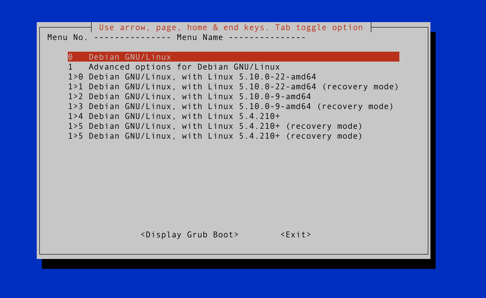

# GRUB Bootloader Configuration

When doing kernel development, you’ll often work with multiple kernel builds: you may be testing different implementations/features, and ideally you also have at least one pristine fallback kernel in case you (almost inevitably) really mess up and build an unbootable kernel.

We use a bootloader to manage these kernels (see [Boot Process](./boot-process.md)); we use it to choose which kernel we boot into, and what parameters we pass to that kernel. **GRUB** is one of the most common bootloaders.

## Installing GRUB

Usually, it is pre-installed.

Example

```bash
sudo apt install grub2
```

## Important Directories and Files

- **/boot/**:  
    The **/boot/** directory contains everything your machine needs during the boot process, including the kernel image that contains your operating system (that’s why you need to copy them to **/boot/** to boot into them). This is also where **GRUB** reads its configuration file from at boot time, and where **update-grub** looks to generate the bootloader configuration file.
- **/boot/grub/grub.cfg**:  
    This is the configuration file that **GRUB** reads from during the boot process. It is written as a shell script, and defines the menu entries that appear on your bootloader menu. This configuration file is usually generated from **/etc/default/grub**, so any changes made here will be lost next time you generate a new configuration file (by running `update-grub`). While we don't usually edit this file, you can read it to make sure `update-grub` did what you expected it to.
- **/etc/default/grub**:  
    This **GRUB** file is what you’ll be editing in order to set up your bootloader. When you run `update-grub`, it will generate the **/boot/grub/grub.cfg** configuration file from the options you set in your **grub** file and the kernels it finds in your **/boot/** directory.

## **GRUB** File Syntax

### Menu Entries in **grub.cfg**

The **grub.cfg** configuration file contains one or more `menuentry` blocks, each representing a single **GRUB** boot menu entry. These blocks always start with the `menuentry` keyword followed by a title, list of options, and an opening curly bracket, and end with a closing curly bracket. Anything between the opening and closing bracket should be indented.

 You can use the [this script](../../scripts/grub_menu.sh) to list all entries in the boot menu. You can pass a parameter to adjust column heading format dynamically based on `short` or `long`. After running this script by `./grub_menu.sh short`, you will see something like this:

 

 If you want to reboot into Kernel **5.10.0-9-amd64** you need to set `GRUB_DEFAULT="1>2"` in **/etc/default/grub**, then run `sudo update-grub`.

### Configuring **/etc/default/grub**

The syntax of this file is declarative. Each option is identified by a key, which you set with `KEY=value`. Here are some useful options:

- `GRUB_DEFAULT`: the default menu entry your bootloader will boot into. The value assigned to this option can be one of three types:
  - Some integer `N`: set the default to be `N`th menu entry.
  - Some string `ID`: set the default to be the kernel identified by the menu entry `ID`.
  - `saved`: if `GRUB_SAVEDEFAULT` is `true`, your bootloader will boot into the last kernel it booted into by default; or if user sets the default one by `grub-set-default`, your bootloader will boot into the user selected one.
- `GRUB_TIMEOUT`: how long your bootloader menu waits before booting into the menu entry.
