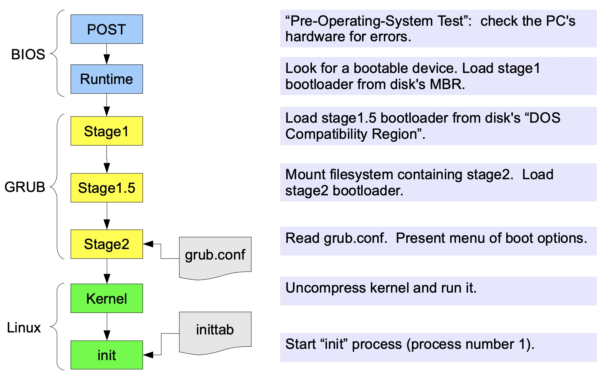

# Boot Process

When a computer starts, the CPU begins loading instructions from a predefined, standard address in memory. This memory location points to the beginning of the BIOS/UEFI, which then chooses (or lets us choose) a boot device.

## BIOS/UEFI

The ***Basic I/O System*** (BIOS) or ***Unified Extensible Firmware Interface*** (UEFI) is a tiny program that starts the boot process.  
It selects a boot device depending on the system configuration. Usually, there’s a default boot order:

1. Hard drives
2. USB drives
3. CD drives

## Bootloader

A BIOS/UEFI system has a bootloader located in the ***MBR*** or ***GPT*** section of the boot device. The bootloader is a small program that loads the operating system. The main job of the bootloader is to perform three actions with the kernel:

1. locate on the disk,
2. insert into memory,
3. and execute with the supplied options.

## Grub

The ***Grub*** (GRand Unified Bootloader) allows us to change the boot configuration without re-installing the bootloader in the ***Master Boot Record*** (MBR). We can reconfigure it by simply editing a file that Grub's stage 2 will read when you reboot.

Typically, the stage 1 bootloader lives in the MBR and does some initialization, then invokes stage 1.5 bootloader which is capable of mounting filesystems, making it easy to reconfigure the boot process by editing normal configuration files with a text editor. The stage 2 bootloader is just a file living in a filesystem.

Grub inserts the kernel into memory and turns control of the system over to the kernel.

## Kernel Files in **/boot**

The kernel itself usually lives in the ***/boot*** directory.

Although there are problems with a monolithic kernel (needing to recompile and reboot to add new features), this type of kernel is a little easier to boot. Now that Linux has modules (see [Kernel Source Tree](./kernel-source-tree.md)), we may need not just the kernel image, but also a few modules in order to get the root filesystem mounted and start the ***init*** process.

Linux bootloaders like Grub allow you to specify an ***initrd*** files associated with a kernel. The ***initrd*** file is a compressed archive containing a few kernel modules, utilities and scripts that help the kernel out during the early part of the boot process.  
A given ***initrd*** will only work with one version of the kernel, because kernel modules are generally tied to a particular kernel version.

## Startup: process 0 and process 1

There are two tasks with specially distinguished process IDs: **idle** has `PID 0` and **init** has `PID 1`.

- **idle**:  
    In Linux `PID 0` is used as the “idle process”, simply does not do anything. It is there so that Linux will always have something that a CPU can execute (for cases that a CPU can’t be stopped to save power). **idle** isn't a conventional user-mode process and does not reside in user space like other user-generated processes. Its main purpose is to create **init** process during system initialization and put the CPU into a low-power state when it has nothing to do.
- **init**:  
    Once the kernel has started, it starts the **init** process, a daemon which then bootstraps the user space, for example by checking and mounting file systems, and starting up other processes. **init** is the first user-space process, thus `PID 1`. The **init** system is the first daemon to start (during booting) and the last daemon to terminate (during shutdown). **init** is the mother of all processes and it is responsible for spawning additional processes and bringing the Linux system up to a state in which productive work can be done, usually under the direction of a special configuration file/script. The **init** system also allows you to manage the services that are running on your system.  
    There are many different implementations of **init** systems, and currently the most commonly used one is **systemd**.
