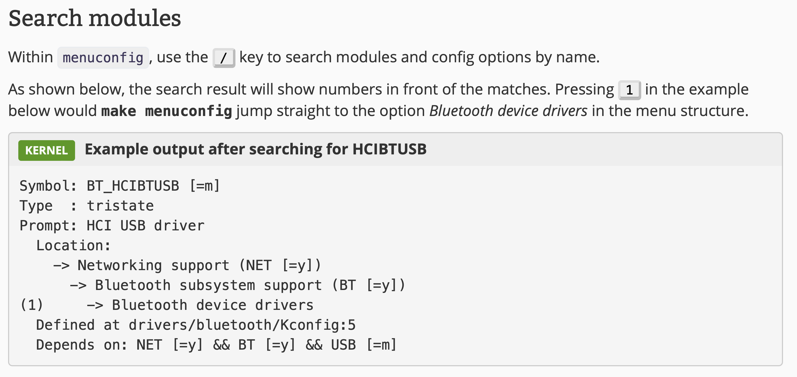

# Compiling the Kernel

## `uname` Command

The uname is a command line tool most commonly used to determine the processor architecture, the system hostname and the version of the kernel running on the system.

Option | Description
------ | -----------
-a | Display all information about the operating system, Kernel version, and hardware
-n | Display the network node hostname
-s | Display the Kernel name
-r | Display the Kernel release version
-m | Display the hardware platform name of the system

## Downloading the Kernel

The first thing to do is downloading the kernel source file.  
[Kernel Source Tree Explained](./kernel-source-tree.md)

## Installing Requirements

In order to compile the kernel, we'll need to install a few dependencies first. Search for those dependencies on the internet and install them.

Example:

``` bash
sudo apt install build-essential bc python bison flex rsync libelf-dev libssl-dev libncurses-dev dwarves
```

## Building the Kernel

Now we change the working directory to the root directory of the Linux Kernel source code.  
Building the kernel consists of two steps: ***configuring the kernel*** and ***compiling and installing the kernel***.

### Configuring the Kernel

Before we compile the kernel, we need to make sure we configure it. Why? You need to specify which modules you want to install and which not to. Perhaps you don’t want to install every module the kernel offers, or maybe you want to add your own module.

In most cases, you probably just want to duplicate the configuration on your running kernel. That config file is stored somewhere in **/boot**. There might be several files that start with **config**, so you want the one associated with your running kernel. You can find that by running `uname -a` and finding the config file that ends with your kernel version number. Copy that file into the source directory as **.config**. Or just run this command:

``` bash
cp /boot/config-$(uname -r)* .config
```

Linux uses ***kbuild*** and ***make*** to automate the building process. We can type `make help` to find the arguments ***make*** accepts.

- Clean the previously generated garbage, if any:
  - `make clean`: delete most generated files, leave enough to build external modules
  - `make mrproper`: delete the current configuration, and all generated files
- Configure the kernel (write to **.config** file)
  - `make oldconfig`: read the current configuration file and prompt you for any new configuration options that have been added since the last kernel version. You can choose to accept the default values or modify the options as needed
  - `make olddefconfig`: create a configuration for your kernel based on the old **.config** file. In case there are any new configs without values, it will use the default automatically
  - `make menuconfig`: create a TUI menu where you can browse options on what the kernel supports
  - `make xconfig`: create a GUI menu where you can browse options on what the kernel supports

#### Menuconfig

If you want to re-use or build upon an old configuration, just copy it into the kernel source directory before you invoke `make menuconfig`. These settings will then become the default values in the menu interface.

Options: `Y`, `N`, `M`

- Y -- compiled into the kernel, available at boot time
- N -- left out
- M -- compiled as a loadable module

You can use `M` when you don't know exactly if you will need some feature in the future. If you compile it as a module and it turns out that it is needed, it will work, but until then it will not bloat the kernel. If you know you will need something anyway, that should be `Y`, not `M`.

Use arrow keys to change cursor position or traverse the menu bar in the bottom. Press `Enter` key to execute selected operation.

Symbol(s) | Description
--------- | -----------
\[ \], \[\*\] | Options in square brackets can be activated or deactivated. The asterisk marks the menu entry as activated. Press `Y` key (Yes) to activate or `N` key (No) to deactivate the selected entry.
\< \>, \<M\>, \<\*\> | Options in angle brackets can be activated, deactivated, or activated as module. The values can be modified by pressing `Y`/`N`/`M` keys.
\{M\}, \{\*\} | Options in curly brackets can be activated or activated as module but not be deactivated. This happens because another feature/driver is dependent on this feature.
\-M\-, \-\*\- | Options between hyphens are activated in the shown way by another feature/driver. There is no choice.



### Compiling and Installing the Kernel

Use **make** to compile the kernel. Best practice when compiling the kernel is to parallelize the build by specifying the number of parallel jobs to run (`-j` option), you can use `nproc` as a good starting point. The `LOCALVERSION` field is appended to the name of your kernel, which can be used as a local identifier.

``` bash
# Create a kernel image and modules
make -j $(nproc) LOCALVERSION=something
# Install the modules
sudo make modules_install -j $(nproc)
# Install the kernel image
sudo make install
```

When these commands finally return, you will have new kernel image and modules built in your kernel directory and also installed to your boot path and module path.

### Specifying a Compiler

The compiler used can be swapped out via `CC=` command line argument to make. `CC=` should be set when selecting a config and during a build.
To use **clang** as the compiler, run the following commands:

``` bash
make CC=clang olddefconfig
make CC=clang -j $(nproc)
```

## Updating Bootloader Configuration

Usually we need to update the bootloader configuration to ensure the new kernel is listed in the boot menu.

## Rebooting the Computer

Shut down and reboot your computer, then verify that you are running the new kernel using `uname -mrs` command.

## Notes on Cross-Compilation

Cross-compilation is the act of compiling code for one computer system (often known as the target) on a different system, called the host. It's a very useful technique, for instance when the target system is too small to host the compiler and all relevant files.

To cross-compile Linux kernel code, we need to download a few dependencies (cross-compilation toolchain) first. Search for those dependencies according to your host and target systems and install them.

The target architecture and cross-compiler prefix (prefix of the cross compilation tools) are defined through the `ARCH` and `CROSS_COMPILE` variables in the top-level **Makefile**. For example, if you're compiling for an **ARM** system, you'd set `ARCH=arm`.

You can either pass `ARCH` and `CROSS_COMPILE` on the **make** command line or define `ARCH` and `CROSS_COMPILE` as environment variables (e.g., use `export` to define them in your shell).

Example

```bash
make menuconfig ARCH=arm64 CROSS_COMPILE=aarch64-linux-gnu-
make ARCH=arm64 CROSS_COMPILE=aarch64-linux-gnu-
```
