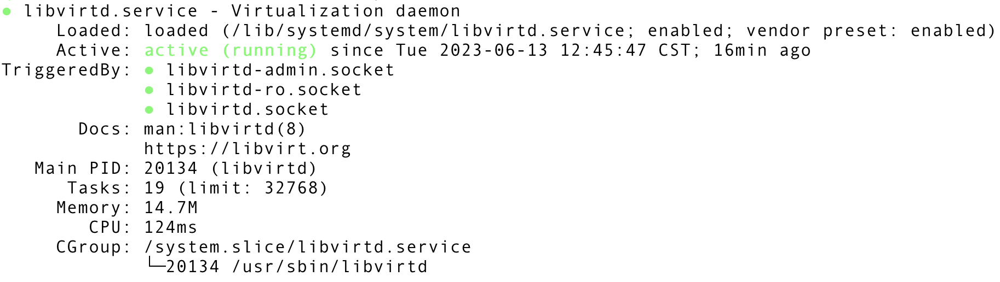

# Setting Up a Virtual Machine

When doing kernel development, you'll (almost inevitably) mess up and build an unbootable kernel. Starting a virtual machine, installing your kernel on it, and rebooting the VM into your kernel, provides a smooth modify-build-test workflow. Kernel code is developed and built on the host machine and then deployed and run on the virtual machine.

## Disk Image

A disk image is a single, large file that faithfully reproduces all of the contents and functionality of a storage device. These files are created as an exact duplicate of the original storage device, where it captures all of its contents, including the file system structure, media files, program files, etc.

It is a perfect format for storing data, making backups, and distributing software since it provides an exact copy of the original storage device. Disk images are also used to create virtual machines.

### OS Installation Media

OS installation media contain the files and software necessary to install an operating system on a computer. It is usually encoded as **ISO** format.

### OS Image

An OS image is a file that contains the OS, your executable, and any data files that might be related to your programs. OS imaging is the process of capturing an OS image from a specific computer. This OS image can then be easily deployed to other computers. It can also be used as backup. Unlike OS installation media, an OS image allows you to create a new instance of that OS without going through a manual installation process. **QCOW2** is a common format for OS images.

#### QCOW2

**QCOW2** is a storage format for virtual disks (QCOW stands for QEMU copy-on-write). When creating a new **QEMU** VM, the user has to setup a virtual hard disk (**QCOW2** file) used to store the operating system and user data for that machine. **QEMU** dynamically allocates physical storage space to a **QCOW2** file. So, if the size of the virtual disk is set to 20GB during setup, **QEMU** delays allocation of the entire 20GB until it is actually needed by the virtual disk. You can also import a VM from an existing **QCOW2** file.

## Installing a VM

Please note that it might be a tedious process if you are installing a VM on a headless remote server, especially when the server itself is a VM exposed to you.

1. Install **QEMU**, **kvm**, and **Libvirt** packages

    ```bash
    sudo apt install qemu-kvm libvirt-daemon-system libvirt-clients
    ```

    Install **virt-manager**, which provides an easier way to create and setup a VM than using **QEMU** directly.  
    (**virt-manager** is built on **Libvirt** library)

    ```bash
    sudo apt install virt-manager
    ```

    Install **virt-customize**, which is a command line tool for customizing virtual machine images.

    ```bash
    sudo apt install libguestfs-tools
    ```

1. Add our user to the **kvm** and **libvirt** user group

    ```bash
    sudo adduser $USER kvm
    sudo adduser $USER libvirt
    ```

    Restart the session for the change to take effect.  
    Use `groups` command to make sure that our user was actually added to required groups:

    ```bash
    groups
    ```

1. Use the `systemctl` command to check the status of **libvirtd**

    ```bash
    sudo systemctl status libvirtd
    ```

    If everything is functioning properly, the output returns an **active (running)** status.

    

    If the virtualization daemon is not active, activate it with the following command:

    ```bash
    sudo systemctl enable --now libvirtd
    ```

1. Setup your VM with `virt-install`

    ```bash
    virt-install --option1=value --option2=value ...
    ```

    [Here](../../scripts/import_vm.sh) is an example script that imports a VM from a virtual disk image.  
    (you need to have a pre-made virtual disk image first)

    [Here](../../scripts/install_vm_using_iso.sh) is an example script that installs a VM using an ISO image.

    Common options:

    | option       | description      |
    | ------------ | ---------------- |
    | `--name` | The name of the VM |
    | `--memory` | The amount of memory to allocate to the VM, in MiB |
    | `--vcpus` | The number of virtual CPUs to allocate to the VM |
    | `--disk` | The storage configuration details for the VM |
    | `--import` | If specified, skips the OS installation and builds a guest around an existing disk image |
    | `--cdrom` | The location of the installation media (file path or network URL) |
    | `--os-variant` | Optimize the VM for a specific operating system that will be installed on the VM |

    Note that the `--disk` option takes various comma-separated options, for example: `size` which is used to specify the size of the virtual disk in GB and `path` which is used to specify a path to use for the disk (it will be created if it doesn’t already exists).

    One thing to note is that the **qemu user** needs search (execute) permissions on all directories leading to the target ISO or disk image. Therefore, you should grant the **qemu user** search permission or put the ISO or disk image in a directory that the **qemu user** already has search permission on.

1. Start your VM
    1. List all guests using the `virsh list --all` command.
    1. Start a guest VM using the `virsh start ${VM Name}` command.
    1. Connect to the serial console (text-based) of the guest VM using the `virsh console ${VM Name}` command.
    1. Connect to the graphical console of the guest VM using the `virt-viewer ${VM Name}` command.

1. View the configuration file of your VM  
    Use the `virsh dumpxml ${VM Name}` command to view the configuration file of your VM.  
    For example, you can find where your VM's disk image is stored and whether a serial console is configured.

1. Modify the configuration file of your VM  
    Use the `virsh edit ${VM Name}` command to modify the configuration file of your VM.  
    For example, you can change the boot kernel path.

1. Shut Down or Delete your VM
    1. Shut down a guest VM using the `virsh shutdown ${VM Name}` command.  
        (you can force a guest VM to stop with the `virsh destroy ${VM Name}` command if the VM is unresponsive)
    1. Delete a VM Guest with `virsh undefine ${VM Name}` command.

## Specifics

When QEMU (VM) is passed **-kernel** option, it emulates **BIOS/firmware** behavior and loads the kernel directly. Otherwise, it runs firmware normally which looks for the **Grub** bootloader in the /boot/ directory on the disk image, which then subsequently looks for the kernel in the /boot/ directory. This means **-kernel** option allows you to specify an external kernel that the virtual machine will use at boot time, instead of using the kernel inside the guest's own disk image. **-kernel** therefore allows you to skip having to install the kernel inside the VM to the /boot/ directory.

1. Install the VM
    - If you download a guest image, you have a pre-configured VM, and this image (usually in **QCOW2** format) contains everything about your guest OS.
    - If you download an installation media (usually in **ISO** format), you need to install the OS on the VM. Then a disk image (usually in **QCOW2** format) will be created and used to store the OS and user data for that VM.

1. Make sure the kernel you want to boot into has the necessary drivers to boot

    1. Run `make menuconfig` to configure the kernel
    1. Press `/`, search for `virtio_pci`, change it to `y`
    1. Press `/`, search for `virtio_net`, change it to `y`
    1. Press `/`, search for `virtio_blk`, change it to `y`
    1. Press `/`, search for `ext4_fs`, change it to `y`
    1. Save and quit
    1. Build kernel: `make bzImage -j $(nproc)`
    1. No other modules or initrd are necessary

1. Customize the OS image with **libguestfs** (make sure your virtual machine is not running before you execute these commands)

    If you want to enlarge the size of the image by 10G (it is recommended to make a backup before doing any resizing to prevent data loss):

    ```bash
    qemu-img resize guest.qcow2 +10G # enlarge the guest's disk image by 10G

    # resize the first partition on device /dev/sda to use any unallocated space,
    # then resize the filesystem on the first partition to use the new space
    # (modify this command according to your device and partition)
    virt-customize \
        --run-command '/bin/bash /bin/growpart /dev/sda 1' \
        --run-command 'resize2fs /dev/sda1' -a guest.qcow2
    ```

1. Boot VM with the kernel you want to test  
    - you can use `qemu` command with `-kernel` option to specify the kernel you want to use;
    - or you can use `virsh edit ${VM Name}` command to modify the configuration file of your VM and change the boot kernel path.

    `virsh edit ${VM Name}` will open a configuration file in an editor, and you can change the boot kernel path in the `<os>` section:

    - `<kernel>` specifies the path to the kernel image file (previously generated **bzImage**)
    - `<cmdline>` specifies the kernel command line arguments (used by kernel at boot time)

    ```xml
    <domain type='kvm'>
      <name>your-VM-name</name>
      ...
      <os>
        <type arch='x86_64'>hvm</type>
        <kernel>/path/to/bzImage</kernel>
        <cmdline>root=/dev/vda1 console=ttyS0 earlyprintk=ttyS0</cmdline>
      </os>
      ...
    </domain>
    ```

    - `root=/dev/vda1` specifies the root filesystem is on `/dev/vda1` (you may need to modify this according to your device and partition)
    - `console=ttyS0` specifies the kernel should redirect its log messages to the serial console (if you don't do this, you could still view the kernel log messages by using `dmesg` command after the VM is booted, this is just for convenience)
    - `earlyprintk=ttyS0` specifies the kernel should redirect its early kernel debugging messages to the serial console

    Note that if your VM fails to boot, it might be that some kernel modules that are necessary for boot-up are missing. Check the early debugging messages and include any missing modules in your kernel.

1. After the VM is started, you can use
    - `virsh console ${VM Name}` command to connect to the serial console (text-based)
    - `virt-viewer ${VM Name}` command to connect to the graphical console
    - `ssh user_name@${VM IP}` command to connect to the VM via SSH
