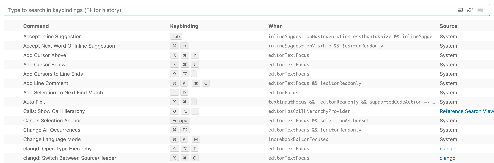

# Setting Up **VSCode** and **clangd** for Kernel Development

## Table of Contents

1. [Remote Development](#remote-development)
1. [**VSCode** Settings Sync](#vscode-settings-sync)
1. [**VSCode** Shortcuts](#vscode-shortcuts)
1. [**VSCode** Multiple Cursors](#vscode-multiple-cursors)
1. [Useful Functionalities in **VSCode**](#useful-functionalities-in-vscode)
1. [Debugger](#debugger)
1. [**clangd**](#clangd)
1. [**clangd** Configuration](#clangd-configuration)
1. [Formatting](#formatting)

## Remote Development

Install **Remote - SSH** extension (or other remote extensions depending on your working environment) for remote development in **VSCode**.

Note that you can connect to a container on a remote machine (first connect to the remote machine and then to the container).

## **VSCode** Settings Sync

**Settings Sync** lets you share your **VSCode** configurations such as settings, keybindings, and installed extensions across your machines so you are always working with your favorite setup. To use this, you need to turn on **settings sync** and sign in to your account.

Note that *keyboard shortcuts are synchronized per platform by default*, e.g., your keyboard shortcut for Mac doesn't sync with the one for Windows. If your keyboard shortcuts are platform-agnostic, you can synchronize them across platforms by disabling the setting `Keybindings Per Platform`.

## **VSCode** Shortcuts

After opening the keyboard shortcuts interface, you will see something like this:



You can search for a keybinding here by typing that keybinding. You can view any user-modified keyboard shortcuts with the **Show User Keybindings** command in the **More Actions** (...) menu. You can also change any keybinding here.

### Keyboard Differences

| Windows | Mac |
| -------- | --- |
| `Ctrl` | `Command` |
| `Alt` | `Option` |

### Common Keybindings (my personal setup -- platform-agnostic)

| Keybinding | Description |
| ---------- | ----------- |
| `Ctrl+m` | go to file |
| `Ctrl+Shift+p` | show all VScode commands, e.g., to restart the language server |
| `Ctrl+b` | toggle sidebar |
| `Ctrl+Shift+b` | toggle secondary sidebar |
| ``Ctrl+` `` | toggle terminal |
| `Ctrl+t` | find symbol (fuzzy search) |
| `Ctrl+f` | find or replace in current file |
| `Ctrl+Shift+f` | find or replace across the workspace |
| `Ctrl+f` or `Ctrl+Shift+f` after selecting some text | search for that text directly without the need to type it |
| `Ctrl+f` after selecting multiple lines | search for some text inside the selection |
| `Ctrl+Shift+q` | quick search across the workspace shown in a dropdown panel |
| type `' '`, `( )`, etc., after selecting some text | add surrounding marks to that text `example` -> `"example"` |
| `Ctrl+s` | save |
| `Ctrl+/` | toggle comment |
| `Ctrl+\` | split editor |
| `Ctrl+k Ctrl+i` | show hover |
| `Ctrl+k Ctrl+g` | toggle codelens |
| `F2` | rename symbol |
| `F12` | go to definition |
| `Alt+F12` | peek definition |
| `Shift+F12` | peek references |
| `Ctrl+F12` | peek type definition |
| `Ctrl+Shift+F12` | find all references and show results in a reference view |
| `Alt+Shift+F12` | find all implementations and show results in a reference view |
| right click | many more functionalities, e.g., peek call hierarchy |
| `Shift+F10` | right click |
| `Ctrl+.` | trigger autocompletion |
| `Ctrl+,` | toggle inline suggestion |
| `Ctrl+n` | select next suggestion, or, move down |
| `Ctrl+p` | select previous suggestion, or, move up |
| `Ctrl+h` | move left |
| `Ctrl+l` | move right |
| `Ctrl+g` | jump to line |
| `Tab` | accept suggestion |
| `Esc` | dismiss suggestion |
| `Alt+]` | show next suggestion |
| `Alt+[` | show previous suggestion |
| `Ctrl+Right Arrow` | accept next word |
| hover over the suggestion | show command palette |
| `Ctrl+Alt` | toggle inlay hints |
| `Ctrl+o` | go back |
| `Ctrl+i` | go forward |
| `Ctrl+shift+o` | open outline view |
| `Ctrl+shift+t` | open timeline view (local file edit history) |
| `Ctrl+Tab` | switch opened window |
| `Ctrl+num` | switch to `num` window, e.g., `Ctrl+2` switches to the second window |
| `Ctrl+w` | delete word left |
| `Ctrl+Shift+[` | fold the innermost uncollapsed region at the cursor |
| `Ctrl+Shift+]` | unfold the collapsed region at the cursor |
| `Ctrl+k Ctrl+num` | fold level `num`, e.g., `Ctrl+k Ctrl+0` folds all, `Ctrl+k Ctrl+1` folds the first level |
| `Ctrl+k Ctrl+j` | unfold all |
| `Ctrl+Shift+v` | open **markdown** preview |
| `Alt+Enter` | toggle bookmark |
| `Alt+Shift+Enter` | reveal bookmark in the current line |

## **VSCode** Multiple Cursors

**VSCode** supports multiple cursors for fast simultaneous edits. You can add secondary cursors with `Alt+Click` (click where your want to insert a cursor while pressing `Alt`). Each cursor operates independently based on the context it sits in.  
You can also select a region for multi-cursors while pressing `Alt+Shift`.

## Useful Functionalities in **VSCode**

- You can manipulate files in the explorer in the sidebar, e.g., create a file or a folder, collapse folders, etc.
- You can drag the integrated terminal to a new window so that you can view it the same way you view an ordinary file.
- You can drag a window out of VSCode and drop it on an empty space on your desktop to create a floating window.
- VSCode supports port-forwarding.
- In some cases, you might be unable to select or copy text from the integrated terminal, e.g., copy text from **tmux**. You can try using the mouse while holding the `Alt` or `Shift` keys.
- You can use the **timeline** view to view the local file edit history and git history.
- You can navigate backward and forward through the history of any file by clicking the Revision Navigation button on the top right corner. Compare changes over time and see the revision history of the whole file or an individual line.
- To compare two files in your workspace:  
  - open the **explorer** view
  - right click on the first file and choose **Select For Compare**
  - right click on the second file and choose **Compare With Selected**
- To compare the git history of files, you can use git plugin which resides in the source control view.
- It is recommended to set **VSCode** as the default editor for git: `git config --global core.editor "code --wait"`. For example, you can visualize and configure interactive rebase operations with a visual editor.
- You can set **Files: exclude** in the settings to hide specific files or folders. This setting might also be respected by some other plugins, e.g., workspace search and some languague servers. **VSCode** can also ignore **git ignore** files.

## Debugger

In general, to debug applications, you need to configure two things per language:

- a debug adapter, which is a generic debugger for a development tool (**VSCode**) that can communicate with different debuggers, such as **gdb** and **pdb**
- how to launch your application to debug or how to attach to a running application (debug configuration)

Therefore, you should install language-specific debugger extensions and write some configuration files. **VSCode** keeps debugging configuration information in a **launch.json** file located in a **.vscode** folder in your workspace (project root folder) or in your user settings or workspace settings.

### **launch.json** Attributes

- `name` - the reader-friendly name to appear in the Debug launch configuration dropdown
- `type` - the type of debugger to use for this launch configuration (language-specific)
- `request` - the request type of this launch configuration, e.g., `launch` or `attach`
- `preLaunchTask` - (optional) to launch a task before the start of a debug session, set this attribute to the label of a task specified in **tasks.json** in the **.vscode** folder

Many debuggers support some of the following attributes:

- `program` - executable or file to run when launching the debugger
- `args` - arguments passed to the program to debug
- `env` - environment variables (the value `null` can be used to "undefine" a variable)
- `cwd` - current working directory for finding dependencies and other files
- `port` - port when attaching to a running process
- `stopOnEntry` - break immediately when the program launches

### Variable Substitution

**VSCode** makes commonly used paths and other values available as variables and supports variable substitution inside strings in **launch.json**. This means that you do not have to use absolute paths in debug configurations.

- `${workspaceFolder}` - the root path of a workspace folder
- `${file}` - the full path of the current opened file in the active editor
- `${fileBasename}` - the current opened file's basename
- `${fileBasenameNoExtension}` - the current opened file's basename with no file extension
- `${fileDirname}` - the current opened file's full folder path
- `${fileDirnameBasename}` - the current opened file's folder name
- `${env:USERNAME}` - the environment variable `USERNAME`
- `${userHome}` - the path of the user's home folder

## **clangd**

**clangd** is a language server that can work with many editors via a plugin and understands your C/C++ code and adds smart features to your editor: code completion, compile errors, go-to-definition and more.

To enable **clangd** in **VSCode**, you need to install the **clangd** extension (it's an extension for **VSCode** not the language server itself). This extension will check if you have **clangd** server installed and if not it will download the server for you.

To understand your source code, **clangd** needs to know your build flags. (This is just a fact of life in C/C++, source files are not self-contained).

By default, **clangd** will assume your code is built as `clang some_file.cc`, and you’ll probably get spurious errors about missing **included files**, etc. To function properly, **clangd** requires a **compile_commands.json** file, which provides compile commands (e.g., include path) for every source file in a project. **clangd** will look in the parent directories of the files you edit looking for it, and also in subdirectories named **build/**. For example, if editing **$SRC/gui/window.cpp**, **clangd** searches in **$SRC/gui/**, **$SRC/gui/build/**, **$SRC/**, **$SRC/build/**, …

**compile_commands.json** is usually generated by tools. For **CMake**-based projects, you can generate this file by specifying a flag:

```bash
cmake -DCMAKE_EXPORT_COMPILE_COMMANDS=1
```

If you are using other build systems such as **make**, you can use [Bear](https://github.com/rizsotto/Bear) to generate a **compile_commands.json** file by recording a complete build. You should run something like this:

```bash
make clean
bear -- make
```

### Generating **compile_commands.json** file for the Linux Kernel

The Linux kernel provides a script to generate this file automatically (it's recommended to build the kernel with **clang**):

```bash
# Only need to build the kernel if you haven't built it yet
make CC=clang olddefconfig
make CC=clang -j $(nproc)
# Generate compile_commands.json
scripts/clang-tools/gen_compile_commands.py
```

If no error occurs, you will find **compile_commands.json** in **/path/to/kernel_source/**.

Note that different kernel configurations may result in different **compile_commands.json** files, since different source files may be included in the build. **clangd** will only index files that are part of the build as per the **compile_commands.json**. Files not involved in the build will not be indexed. However, **clangd** can dynamically index files when you open them in your editor, even if they are not part of the initial **compile_commands.json**, which allows for a more flexible and responsive development environment.

## **clangd** Configuration

If you are compiling the kernel with **gcc** rather than **clang**, **clangd** might report some compatibility errors with **gcc**-specific compilation flags. To mitigate these errors, create a file **~/.config/clangd/config.yaml** with the following:

```yaml
CompileFlags:
    Remove: [   -mpreferred-stack-boundary=*,
                -mindirect-branch*,
                -fno-allow-store-data-races,
                -fno-var-tracking-assignments,
                -fconserve-stack,
                -mrecord-mcount,
            ]
```

This file tells **clangd** to automatically remove the listed **gcc**-specific flags. Feel free to add to this list of flags if other errors appear.

## Formatting

**clangd** embeds **clang-format**, which can reformat your code: fixing indentation, breaking lines, and reflowing comments.  
The Linux kernel provides a **.clang-format** file, which specifies how to format the source code using **clang-format**.

You can configure **VSCode** to format on save (Editor: Format on Save).
