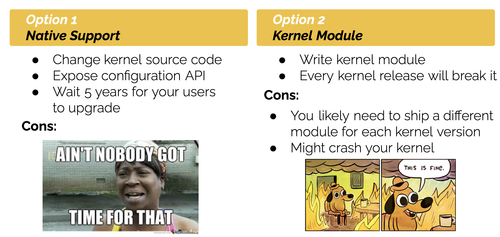
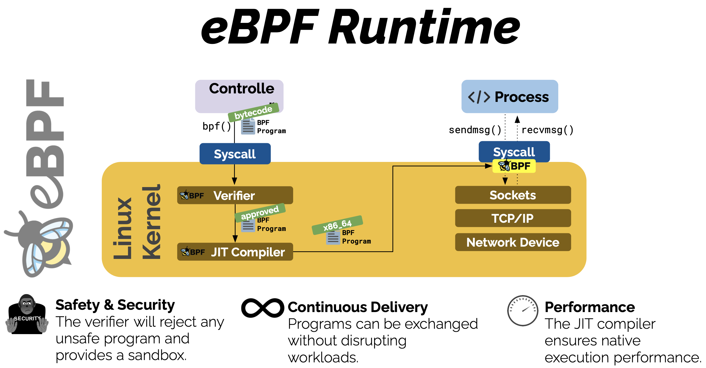

# eBPF

Refet to [documentation](https://ebpf.io) for more information.

**eBPF** is a technology that can run sandboxed programs (run in a restricted operating environment called "sandbox", where its actions are controlled and isolated from the rest of the system) in a privileged context such as the operating system kernel. Linux has in-kernel support for **eBPF**. It can be used to safely and efficiently extend the capabilities of the kernel without requiring to change kernel source code or load kernel modules.

By allowing to run sandboxed programs within the operating system, application developers can run **eBPF** programs to add additional capabilities to the operating system at runtime. The operating system then guarantees safety and execution efficiency as if natively compiled with the aid of a Just-In-Time (JIT) compiler and verification engine.

## Table of Contents

1. [Why eBPF](#why-ebpf)
1. [Overview](#overview)
1. [CO-RE, BTF, and Libbpf](#co-re-btf-and-libbpf)
1. [eBPF Hello World](#ebpf-hello-world)

## Why eBPF

Traditionally, to add new features to the kernel, you have two options:



The benefits of **eBPF** are:



## Overview

**eBPF** programs are event-driven and are run when the kernel or an application passes a certain hook point. There are some predefined hooks you can use, or if a predefined hook does not exist for a particular need, it is possible to create your own hooks to attach **eBPF** programs almost anywhere in kernel or user applications. Your program will be called when the hook is hit.

**eBPF** programs run in **eBPF** Virtual Machine, which is a software implementation of a computer.

- Bytecode  
    The VM takes in a program in the form of **eBPF** bytecode instructions, which are designed for verifiability. These bytecode instructions have to be converted to native machine instructions that run on the CPU.  
    It’s possible to write **eBPF** code directly in this bytecode, much as it’s possible to program in assembly language. However, developers usually write **eBPF** programs in a higher-level language and then compile them to **eBPF** bytecode.
- Verifier  
    The verifier works on **eBPF** bytecode, checks every possible execution path through the program and ensures that every instruction is safe. The program must meet certain conditions otherwise the verifier will reject it. The verifier also makes some updates to the bytecode to ready it for execution.
- Just-in-time compiler  
    The JIT compilation step translates the generic bytecode of the program into the machine-specific instruction set to optimize execution speed of the program. This makes **eBPF** programs run as efficiently as natively compiled kernel code or as code loaded as a kernel module.

When **eBPF** programs are triggered at their hook points, they can call helper functions which are exposed by the kernel (they cannot call arbitrary kernel functions for security reasons). **eBPF** also offers **eBPF Maps**, which are data structures that can be used to store and share data among multiple **eBPF** programs or to communicate between a user space application and **eBPF** code running in the kernel. Typical uses include:

- User space writing configuration information to be retrieved by an **eBPF** program
- An **eBPF** program storing state, for later retrieval by another **eBPF** program (or a future run of the same program)
- An **eBPF** program writing results or metrics into a map, for retrieval by the user space app that will present results

**eBPF** implements **Tail Call**. The general motivation behind tail calls is to avoid adding frames to the stack over and over again as a function is called recursively, which can eventually lead to stack overflow errors. If you can arrange your code to call a recursive function as the last thing it does, the stack frame associated with the calling function isn’t really doing anything useful. Tail calls allow for calling a series of functions without growing the stack. In other words, execution doesn’t return to the caller after a tail
call completes.

A typical **eBPF** program is divided into two parts:

- a user space program that loads the **eBPF** bytecode into the kernel and interacts with it
- a kernel program (**eBPF** bytecode) that executes specific events, and if needed, sends the results to the user space

## CO-RE, BTF, and Libbpf

- **CO-RE**: Compile Once, Run Everywhere
- **BTF**: BPF Type Format, a format for describing kernel data structures' layouts
- **Libbpf**: Library for loading and interacting with eBPF programs, including declarations of helper functions and maps that your eBPF program can use

**CO-RE** offers a good solution to the problem of cross-kernel portability for eBPF programs. Many eBPF programs access kernel data structures, and an eBPF programmer would need to include relevant Linux header files so that their eBPF code can correctly locate fileds within those data structures. However, the internal kernel structures can change between different kernel versions, so we need a way to ensure that an eBPF program compiled for one kernel version can still access the correct fields even if the kernel version changes.

## eBPF Hello World

(WIP)

1. First we need to make sure our kernel is built with eBPF-related configurations, such as `CONFIG_BPF_SYSCALL` and `CONFIG_BPF_JIT`.
1. Usually, eBPF programs running in the kernel space are developed in `C` language and compiled to eBPF bytecode by `Clang` compiler. `libbpf` library is used to load and interact with eBPF programs. Make sure you have all those installed.

    ```bash
    sudo apt install clang libbpf-dev
    ```

1.
