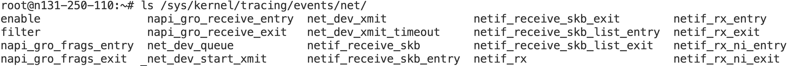

# Kernel Tracepoints

Kernel tracepoints simply represent static hooks to events of interest, which can be used to build a "Big Picture" of what is going on within the system.

## Table of Contents

1. [Purpose of Tracepoints](#purpose-of-tracepoints)
1. [Where Are Tracepoints](#where-are-tracepoints)
1. [Which Function to Trace](#which-function-to-trace)
1. [Enabling Event Tracing](#enabling-event-tracing)
1. [Writing a Tracepoint](#writing-a-tracepoint)
1. [Using a Tracepoint](#using-a-tracepoint)
1. [Tracepoint in a Kernel Module](#tracepoint-in-a-kernel-module)
1. [Connecting a Function to a Tracepoint](#connecting-a-function-to-a-tracepoint)

## Purpose of Tracepoints

A tracepoint placed in code provides a hook to call a function (probe) that you can provide at runtime. A tracepoint can be **on** (a probe is connected to it) or **off** (no probe is attached). When a tracepoint is **off** it has no effect, except for adding a tiny time penalty (checking a condition for a branch) and space penalty (adding a few bytes for the function call at the end of the instrumented function and adds a data structure in a separate section). When a tracepoint is **on**, the function you provided is called each time the tracepoint is executed, in the execution context of the caller. When the function provided ends its execution, it returns to the caller (continuing from the tracepoint site).

## Where Are Tracepoints

- Currently defined kernel tracepoints can be found in your system directory **/sys/kernel/tracing/events/\***
- Define new kernel tracepoints in kernel source directory **include/trace/events/**

**/sys/kernel/tracing/events** can only be accessed as the **root user**. Each of its subdirectories contains tracepoints that correspond to events of many different types such as system calls and network processing.

Example: Net Subsystem defines multiple events



- The **enable** file is used to switch on/off a probe or a set of probes.
- The **filter** file is used to filter events by specifying filter expressions which operate on trace data fields.

## Which Function to Trace

See [here](./tracing-system-overview.md#which-function-to-probe).

## Enabling Event Tracing

To see the tracepoints appear on the tracing buffer, we first need to make sure tracing feature is enabled:

```bash
echo 1 > /sys/kernel/tracing/tracing_on
```

The events which are available for tracing can be found in the file **/sys/kernel/tracing/available_events**.  
The events are organized into subsystems, such as **irq**, **sched**, etc., and a full event name looks like this: **\<subsystem\>:\<event\>**.  The subsystem name is optional, but it is displayed in the **available_events** file.  All of the events in a subsystem can be specified via the syntax **\<subsystem\>:\***.

### Via the `set_event` Interface

To enable a particular event, such as **sched_wakeup**, simply `echo` it to **/sys/kernel/tracing/set_event**. For example:  
(note that `>>` is necessary, otherwise it will firstly disable all the events)

```bash
echo sched_wakeup >> /sys/kernel/tracing/set_event
```

To disable an event, `echo` the event name to the **set_event** file prefixed with an exclamation point:

```bash
echo '!sched_wakeup' >> /sys/kernel/tracing/set_event
```

To disable all events, `echo` an empty line to the **set_event** file:

```bash
echo > /sys/kernel/tracing/set_event
```

To enable all **irq** events, you can use the command:

```bash
echo 'irq:*' > /sys/kernel/tracing/set_event
```

### Via the `enable` Toggle

The events available are also listed in **/sys/kernel/tracing/events/** hierarchy of directories. When reading one of the **enable** files in those directories, there are four possible results:

- 0 - all events this file affects are disabled
- 1 - all events this file affects are enabled
- X - there is a mixture of events enabled and disabled
- ? - this file does not affect any event

To enable event **sched_wakeup**:

```bash
echo 1 > /sys/kernel/tracing/events/sched/sched_wakeup/enable
```

To disable it:

```bash
echo 0 > /sys/kernel/tracing/events/sched/sched_wakeup/enable
```

To enable all events in **sched** subsystem:

```bash
echo 1 > /sys/kernel/tracing/events/sched/enable
```

## Writing a Tracepoint

You can refer to [sample code](https://github.com/torvalds/linux/tree/master/samples/trace_events) for examples and detailed explanation.

- To insert a new tracepoint into the Linux kernel, define a new header file with a special format.

- By default, tracepoint kernel files are located in **include/trace/events/** directory, but the kernel has functionality so that the header files can be located in a different path. This is useful when defining a tracepoint in a kernel module.

- A tracepoint is declared using the `TRACE_EVENT` macro. But `TRACE_EVENT` does not yet instantiate it in the code. The tracepoint has arguments which are passed to at its actual instantiation. Tracepoints added with the `TRACE_EVENT` macro allow some high-level tracer system to use them.

- To use the tracepoint, the header file must be included in any file that inserts the tracepoint, and a single `C` file must define `CREATE_TRACE_POINTS`.

### `TRACE_EVENT()` Macro

```c
TRACE_EVENT(name, prototype, args, structure, assign, print)
```

All parameters except the first one are encapsulated with another macro. These macros give more control in processing and also allow commas to be used within the `TRACE_EVENT()` macro.

- **name** - the name of the tracepoint to be created (`foo_bar` in this case). The actual tracepoint function that is used has `trace_` prefixed to the name (i.e., `trace_foo_bar`).

    ```c
    TRACE_EVENT(foo_bar, prototype, args, structure, assign, print)
    ```

- **prototype** - the prototype for the tracepoint callbacks (wrapped by `TP_PROTO` macro)

    ```c
    TRACE_EVENT(foo_bar,
        TP_PROTO(const char* foo, int bar, const int* lst,
                    const struct cpu_mask* mask, const char* fmt, va_list* va),
        ...
    )
   ```

    The prototype is written as if you were to declare the tracepoint function directly:

    ```c
    trace_foo_bar(const char* foo, int bar, const int* lst,
                    const struct cpu_mask* mask, const char* fmt, va_list* va)
    ```

    It is used as the prototype for both the tracepoint added to the kernel code and for the callback function. Remember, a tracepoint calls the callback functions as if the callback functions were being called at the location of the tracepoint.

- **args** - the arguments that match the prototype

    ```c
    TRACE_EVENT(foo_bar,
        TP_PROTO(const char* foo, int bar, const int* lst,
                    const struct cpu_mask* mask, const char* fmt, va_list* va),
        TP_ARGS(foo, bar, lst, mask, fmt, va),
        ...
    )
    ```

- **structure** - the structure layout of the data that will be stored in the tracer's ring buffer. Each element of the structure is defined by another macro. These macros are used to automate the creation of a structure and are not function-like. Notice that the macros are not separated by any delimiter (no comma nor semicolon).

    ```c
    TRACE_EVENT(foo_bar,
        TP_PROTO(const char* foo, int bar, const int* lst,
                    const struct cpu_mask* mask, const char* fmt, va_list* va),
        TP_ARGS(foo, bar, lst, mask, fmt, va),
        TP_STRUCT__entry(
                        __field(const char*, foo)
                        __field(int, bar)
        ),
        ...
    )
    ```

    `__field(type, name)` - this defines a normal structure element, like `int var`; where type is `int` and name is `var`

- **assign** - defines the way the data from the parameters is saved to the ring buffer
- **print** - defines how a `printk()` can be used to print out the fields from the `TP_STRUCT__entry` structure.

### Header File Format

The header file that contains the `TRACE_EVENT` macro must follow a certain format so that it will work with other tracer systems.

If we are writing a tracepoint for **my_trace_system** events, the structure should be:

```c
#undef TRACE_SYSTEM
#define TRACE_SYSTEM my_trace_system

#if !defined(_TRACE_MY_EXAMPLE_H) || defined(TRACE_HEADER_MULTI_READ)
#define _TRACE_MY_EXAMPLE_H

#include <linux/tracepoint.h>

TRACE_EVENT(foo_bar,
            ...
)

#endif /* _TRACE_MY_EXAMPLE_H */

/* This part must be outside protection */
#include <trace/define_trace.h>
```

 The `TRACE_HEADER_MULTI_READ` test allows this file to be included more than once; this is important for the processing of the `TRACE_EVENT` macro. The `TRACE_SYSTEM` must also be defined for the file and must be outside the guard of the `#if`. The `TRACE_SYSTEM` defines what group the `TRACE_EVENT` macros in this file belong to (you can define multiple events in this file). This is also the directory name that the events will be grouped under the **/kernel/tracing/events/** directory. This grouping is important for other tracer systems as it allows the user to enable or disable events by group.

All trace headers should include **tracepoint.h**.

The **define_trace.h** is where all the magic lies in creating the tracepoints. It must be included at the bottom of the trace header file outside the protection of the `#endif`.

If this header file is not located in the **include/trace/events/** directory, we need to add additional instructions to specify the **include path**.

### `DECLARE_EVENT_CLASS()` Macro

Each `TRACE_EVENT` macro creates several helper functions to produce the code to add the tracepoint, create the files in the trace directory, hook it to other tracer systems, assign the values and print out the raw data from the ring buffer. To prevent too much bloat, if there are more than one tracepoint that uses the same format for the `prototype`, `args`, `structure`, `assign` and `print`, and only the `name` is different, it is highly recommended to use the `DECLARE_EVENT_CLASS`.

`DECLARE_EVENT_CLASS` macro creates most of the functions for the tracepoint. Then `DEFINE_EVENT` is use to hook a tracepoint to those functions.

## Using a Tracepoint

Defining the tracepoint is meaningless if it is not used anywhere. To use the tracepoint, the trace header must be included, but one `C` file (and only one) must also define `CREATE_TRACE_POINTS` before including the trace. This will cause the **define_trace.h** to create the necessary functions needed to produce the tracing events. For example:

```c
#define CREATE_TRACE_POINTS
#include <trace/events/my_example.h>
```

If another file needs to use tracepoints that were defined in the trace header file, then it only needs to include the trace file, and does not need to define `CREATE_TRACE_POINTS`. Defining it more than once for the same header file will cause linking errors when building.

```c
#include <trace/events/my_example.h>
```

Finally, the tracepoint is used in the code just as it was defined in the `TRACE_EVENT` macro:

```c
#define CREATE_TRACE_POINTS
#include <trace/events/my_example.h>

void do_something(int num)
{
    /* Do something */
    ...

    /* Insert the static tracepoint */
    trace_foo_bar(foo, bar, lst, mask, fmt, va)

    /* Do something else */
    ...
}
```

After building the kernel, you should be able to see a new **my_trace_system** directory inside **/sys/kernel/tracing/events/**, which contains a **foo_bar** event tracepoint. You can then enable the function tracer on the `do_something()` function. When a tracepoint is hit and data is logged, you can view the output in the tracing buffer by reading the trace file located at **/sys/kernel/tracing/trace**.

## Tracepoint in a Kernel Module

If this header file is not located in the **include/trace/events/** directory, e.g., when it is part of an external module, we need to specify `TRACE_INCLUDE_PATH`.  
Assume our header file is named **my_example.h**:

```c
...
#endif

/* This part must be outside protection */
#undef TRACE_INCLUDE_PATH
#undef TRACE_INCLUDE_FILE
#define TRACE_INCLUDE_PATH .
#define TRACE_INCLUDE_FILE my_example

#include <trace/define_trace.h>
```

Assuming the module is named **my_module.c**, its **Makefile** would look as follows:

```makefile
obj-m := my_module.o
CFLAGS_my_module.o += -I$(src)

LINUX_KERNEL := $(shell uname -r)
LINUX_KERNEL_PATH := /usr/src/linux-headers-$(LINUX_KERNEL)

all:
    $(MAKE) -C $(LINUX_KERNEL_PATH) M=$(PWD) modules

install:
    $(MAKE) -C $(LINUX_KERNEL_PATH) M=$(PWD) modules_install

clean:
    $(MAKE) -C $(LINUX_KERNEL_PATH) M=$(PWD) clean
```

Note the `CFLAGS_my_module.o` is used to include in the search path the folder containing the trace header file.

## Connecting a Function to a Tracepoint

Connecting a function (probe) to a tracepoint is done through `register_trace_subsys_eventname()`. Removing a probe is done through `unregister_trace_subsys_eventname()`; it will remove the probe. Note that you should replace `subsys` and `eventname` with your actual subsystem name and event name. `tracepoint_synchronize_unregister()` must be called before the end of the module `exit` function to make sure there is no caller left using the probe. This, and the fact that preemption is disabled around the probe call, make sure that probe removal and module unload are safe.

However, it's recommended to use other tracer system, such as [eBPF](./ebpf.md), to register callbacks for tracepoints instead of doing all this manually.
