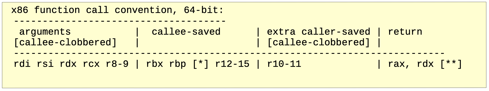

# Kprobe

**Kprobe** allows to insert breakpoints at almost any kernel address dynamically and allows to extract debugging and performance information.

Support should be enabled using `CONFIG_KPROBES=y`.

When a kprobe is registered, it makes a copy of the probed instruction and replaces the first byte(s) of the probed instruction with a breakpoint instruction. When a CPU hits the breakpoint instruction, a trap occurs, the CPU's registers are saved, and control passes to **Kprobe**, which executes the **pre_handler** associated with the kprobe, passing the handler the addresses of the kprobe struct and the saved registers. Next, **Kprobe** single-steps its copy of the probed instruction. After the instruction is single-stepped, **Kprobe** executes the **post_handler**, if any, that is associated with the kprobe. Execution then continues as usual with the instruction following the probepoint.

Probe handlers are run with preemption disabled. In any case, your handler should not yield the CPU (e.g., by attempting to acquire a semaphore).

## Table of Contents

1. [Changing Execution Path](#changing-execution-path)
1. [Types of Handlers](#types-of-handlers)
1. [Which Function to Probe](#which-function-to-probe)
1. [Blacklist](#blacklist)
1. [Using Kprobe](#using-kprobe)
1. [Kprobe Example](#kprobe-example)
1. [Return Probes](#return-probes)
1. [Kprobe-based Event Tracing](#kprobe-based-event-tracing)

## Changing Execution Path

Since **Kprobe** can probe into a running kernel code, it can change the register set or other kernel data structures, including instruction pointer. This operation requires maximum care, such as keeping the stack frame, recovering the execution path etc.

But it also means that **Kprobe** can be used, for example, to install a bug fix or to inject faults for testing.

## Types of Handlers

- A **pre-handler routine**: Invoked just before the probepoint.
- A **post-handler routine**: Invoked just after the probepoint.

## Which Function to Probe

See [here](./tracing-system-overview.md#which-function-to-probe).

## Blacklist

**Kprobe** can probe most of the kernel except itself. This means that there are some functions where **Kprobe** cannot probe. Probing (trapping) such functions can cause a recursive trap (e.g. double fault) or the nested probe handler may never be called. **Kprobe** manages such functions as a blacklist. If you want to add a function into the blacklist, you just need to

1. include **\<linux/kprobes.h\>**
2. use `NOKPROBE_SYMBOL()` macro to specify a blacklisted function

**Kprobe** checks the given probe address against the blacklist and rejects registering it, if the given address is in the blacklist.

## Using Kprobe

To use **Kprobe**, you need to include **\<linux/kprobes.h\>**.  
To register a kprobe, you need to call `register_kprobe()` with a pointer to a `kprobe` struct. `register_kprobe()` returns 0 on success, or a negative error value otherwise.

```c
int register_kprobe(struct kprobe *kp);
```

`struct kprobe` is the structure that defines a specific probepoint. You can use either `symbol_name` or `addr` to specify the symbol or address you want to probe. If you use `symbol_name`, the probepoint address resolution will be taken care of by the kernel.

You can also use the `offset` field if the offset into the symbol address to install a probepoint is known. This field is used to calculate the probepoint. To find the offset, you might need to disassemble the kernel code and look into the assembly code. See [here](../kernel-utilities/kernel-debugging.md#using-objdump-to-disassemble-the-binary-code) for how to disassemble kernel code.

```c
int ret;

static struct kprobe kp = {
    .symbol_name = "symbol_name",   // the name of the symbol to be probed
    .pre_handler = pre_handler,     // the pre-handler routine
    .post_handler = post_handler,   // the post-handler routine
};

ret = register_kprobe(&kp);
```

`register_kprobe()` sets a breakpoint at the symbol `kp->symbol_name` or the address `kp->addr`. When the breakpoint is hit, **Kprobe** calls `kp->pre_handler`. After the probed instruction is single-stepped, **Kprobe** calls `kp->post_handler`. Any or all handlers can be `NULL`. If `kp->flags` is set `KPROBE_FLAG_DISABLED`, that `kp` will be registered but disabled, so, its handlers aren't hit until calling `enable_kprobe(kp)`.

**User's pre-handler** (`kp->pre_handler`):

```c
static int __kprobes pre_handler(struct kprobe *p, struct pt_regs *regs);
```

Called with `p` pointing to the kprobe associated with the breakpoint, and `regs` pointing to the struct containing the registers saved when the breakpoint was hit.  
If you are probing a particular function's entry point, you can use `regs` to access the input arguments. To do that, you usually need to know the calling convention of your system. For example,



In this case, `rdi` stores the first argument, `rsi` stores the second ...

`__kprobes` macro will place the function in a separate section which is not findable by **Kprobe** thus preventing infinite breakpoints.  
Usually this function should return 0.

**User's post-handler** (`kp->post_handler`):

```c
static void __kprobes post_handler(struct kprobe *p, struct pt_regs *regs, unsigned long flags);
```

To unresiger a probepoint:

```c
void unregister_kprobe(struct kprobe *kp);
```

You can also temporarily disable/enable a probepoint:

```c
int enable_kprobe(struct kprobe *kp);

int disable_kprobe(struct kprobe *kp);
```

## Kprobe Example

Refer to [here](../kernel-module/hello-world-module.md) for how to write a kernel module.

To register a counter to a probed function, we can write the following code:

```c
#include <linux/kprobes.h>
#include <linux/module.h>

// Module metadata
MODULE_AUTHOR("Zhou Qinren");
MODULE_LICENSE("GPL");
MODULE_DESCRIPTION("Kprobe Example");

static unsigned int counter = 0;

static int __kprobes pre_handler(struct kprobe* p, struct pt_regs* regs) {
    printk(KERN_INFO "Kprobe Example, pre_handler: hit!\n");
    return 0;
};

static void __kprobes post_handler(struct kprobe* p, struct pt_regs* regs, unsigned long flags) {
    printk(KERN_INFO "Kprobe Example, post_handler: counter=%u\n", counter++);
}

static struct kprobe kp = {
    // use either symbol_name or addr
    .symbol_name = "symbol_name", // the name of the probed symbol
    // .addr = (kprobe_opcode_t*)MEMORY_ADDRESS,
    .pre_handler = pre_handler,
    .post_handler = post_handler,
};

static int __init kp_example_init(void) {
    int ret;
    printk(KERN_INFO "Kprobe example module inserted.\n");

    ret = register_kprobe(&kp);
    if (ret < 0) {
        pr_err("register_kprobe failed, returned %d\n", ret);
        return ret;
    }
    return 0;
}

static void __exit kp_example_exit(void) {
    unregister_kprobe(&kp);
    printk(KERN_INFO "Kprobe example module removed.\n");
}

module_init(kp_example_init);
module_exit(kp_example_exit);
```

After you insert this kernel module, each time you type and execute a program you should see a counter message (in the kernel log, so you might need to run `dmesg` if you are non-root user).

## Return Probes

You can also register a return probepoint (`struct kretprobe *rp`) with `register_kretprobe()` to probe a function's return value.  
The `kretprobe` structure internally contains the `kprobe` structure, allowing you to set up the probe point (the function to return the probe) via it.

Refer to [here](../../scripts/kretprobe_example.md) for an example.

**Kprobe** establishes a probepoint at the entry to the function. When the probed function is called, **Kprobe** saves a copy of the return address and replaces the return address with the address of a special instruction. When the probed function executes its return instruction, control passes to the special instruction. **Kprobe** then calls the user-specified return handler associated with the probepoint, then sets the saved instruction pointer to the saved return address, and that's where execution resumes upon return from the trap.

### Kretprobe Entry-handler

**Kretprobe** also provides an optional user-specified handler which runs on function entry. This handler is specified by setting the `entry_handler` field of the `struct kretprobe`. Whenever the kprobe placed by **kretprobe** at the function entry is hit, the user-defined `entry_handler`, if any, is invoked. If the `entry_handler` returns 0 (success) then a corresponding return handler is guaranteed to be called upon function return. If the `entry_handler` returns a non-zero error then **Kprobe** leaves the return address as is, and the **kretprobe** has no further effect for that particular function instance.

Multiple entry and return handler invocations are matched using the unique **kretprobe_instance** object associated with them. Additionally, a user may also specify per return-instance private data to be part of each **kretprobe_instance** object. This is especially useful when sharing private data between corresponding user entry and return handlers. The size of each private data object can be specified at kretprobe registration time by setting the `data_size` field of the `struct kretprobe`. This data can be accessed through the `data` field of each **kretprobe_instance** object. You can also access other fields through this instance object, such as `ret_addr` and `task`.

### `maxactive`

Before calling `register_kretprobe()`, the user sets the `maxactive` field of the `struct kretprobe` to specify how many instances of the specified function can be probed simultaneously. `register_kretprobe()` pre-allocates the indicated number of **kretprobe_instance** objects.

For example, if the function is non-recursive and is called with a spinlock held, `maxactive = 1` should be enough. If the function is non-recursive and can never relinquish the CPU (e.g., via a semaphore or preemption), the number of CPUs should be enough.

It's not a disaster if you set `maxactive` too low; you'll just miss some probes.

## Kprobe-based Event Tracing

**/sys/kernel/tracing** is the directory where the event tracing system is mounted.

Use event tracing system to set up a kprobe (so that you can type a few commands instead of writing code to register a kprobe):

```bash
echo "p:<kprobe-name> <function-to-kprobe> […]" >> /sys/kernel/tracing/kprobe_events
```

The `p:` specifies you're setting up a (dynamic) kprobe. The name following the `:` character is any name you wish to give this probepoint (it will default to the function name if you don't pass anything). Then, put a space and the actual function to probe. Optional arguments can be used to specify more configuration, e.g., querying the probed function's parameter values.

Example

```bash
echo "p:my_sys_open do_sys_open" >> /sys/kernel/tracing/kprobe_events
```

Now that it's set up, under the **/sys/kernel/tracing/events/kprobes/** folder, you will find a (pseudo) folder named **my_sys_open**.  
**/sys/kernel/tracing/events/kprobes/** contains all dynamic kprobes that have been defined.

You can refer to [here](./kernel-tracepoints.md#enabling-event-tracing) for how to enable and disable a probepoint through event tracing system.  
Note that **tracing/kprobe_events** is to Kprobe as **tracing/set_event** is to kernel tracepoints.

After enabling a kprobe, you can find the output in **/sys/kernel/tracing/trace**.  
You can also run `cat trace_pipe` to watch the file interactively.

To disable the kprobe and destroy it:

```bash
echo 0 > /sys/kernel/tracing/events/kprobes/my_sys_open/enable
echo "-:my_sys_open" >> /sys/kernel/tracing/kprobe_events
```
