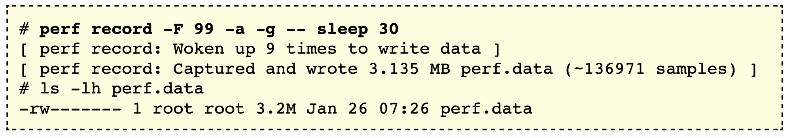

# Perf

Linux **perf** is a low-overhead tool that supports many profiling/tracing features. For example, it can help you understand CPU usage quickly and completely.

The **perf** tool can measure events (something that you want to monitor) coming from different sources. For instance, some events are pure kernel counters (e.g., context-switches), some others might be hardware events (e.g., the number of cycles, cache misses), static tracepoints, or dynamic probes.

[This](https://www.brendangregg.com/perf.html) is a good introduction to **perf**, remember to take a look at this [one-liners](https://www.brendangregg.com/perf.html#OneLiners).

## Table of Contents

1. [Prerequisites](#prerequisites)
    1. [Symbols](#symbols)
    1. [Stack Traces](#stack-traces)
    1. [perf_event_paranoid](#kernelperf_event_paranoid)
    1. [Testing Stacks](#testing-stacks)
1. [On-CPU and Off-CPU](#on-cpu-and-off-cpu)
1. [Usage](#usage)
1. [Options Controlling Environment Selection](#options-controlling-environment-selection)
1. [CPU Statistics](#cpu-statistics)
1. [Timed Profiling](#timed-profiling)
    1. [Children and Self](#children-and-self)
1. [Flame Graphs](#flame-graphs)
    1. [Creating a Flame Graph](#creating-a-flame-graph)

## Prerequisites

### Symbols

Linux **perf**, like other debug tools, needs symbol information. These are used to translate memory addresses into function and variable names, so that they can be read by humans. Without symbols, you'll see numbers representing the memory addresses profiled.


If the software was added by packages, you may find debug packages (often **-dbgsym**) which provide the symbols. Sometimes `perf report` will tell you to install these: "no symbols found in /bin/dd, maybe install a debug package?".

Kernel-level symbols are in the kernel debuginfo package, or when the kernel is compiled with `CONFIG_KALLSYMS`.

Programs that have virtual machines execute their own virtual processor, which has its own way of executing functions and managing stacks. If you profile these using **perf**, you'll see symbols for the VM engine, which have some use (e.g., to identify if time is spent in garbage collection), but you won't see the language-level context you might be expecting (e.g., you won't see classes and methods). **perf** has JIT support to solve this and you might need to install extra packages.

### Stack Traces

**Stack walking**, also known as **stack unwinding** or **backtracing**, is the process of determining the sequence of function calls that led to a particular point in a program's execution. This is often used for debugging, profiling, and error reporting. If the stacks in `perf report` are often < 3 frames, or don't reach "thread start" or `main` function, they are probably broken.


Once upon a time, when computer architectures had fewer registers, the frame pointer register was reused (omitted) for general purpose to improve performance. However, this breaks system stack walking and therefore breaks debuggers. To fix the broken stacks, you can compile the code with frame pointers or use some other tools to unwind the stacks.

- For user application, compile it with `-fno-omit-frame-pointer`
- For incomplete kernel stacks, fix them by setting `CONFIG_FRAME_POINTER=y`
- If your kernel supports **dwarf**, you can use `--call-graph dwarf` to unwind the stacks

`--call-graph` option sets up and enables call-graph recording. You can specify the stack walking method. Default is `fp`, frame pointer based unwinding (for user space).

If a program was compiled with `--fomit-frame-pointer`, then you can use `--call-graph dwarf,8192` to unwind the stacks. `dwarf` provides accurate and detailed information, even in optimized code, but it is much slower than `fp` and requires heavy post-processing before it can be used.

When `dwarf` recording is used, **perf** records (user) stack dump when sampled. You can specify the size of the stack dump in bytes by appending the size to the `dwarf` option, like `--call-graph dwarf,4096`. Note that if you have some very large automatic variables, you may need to increase the stack dump size, otherwise the stacks won't be dumped correctly because the stack is truncated.

### `kernel.perf_event_paranoid`

`kernel.perf_event_paranoid` is a Linux kernel parameter that controls the level of access to performance monitoring and profiling features provided by the **perf_events** subsystem. You can check the current value using the following command:

```bash
cat /proc/sys/kernel/perf_event_paranoid
```

You can tweak this setting to allow access to these features. Note that you can also run **perf** with root privileges, e.g., `sudo perf record ...`

### Testing Stacks

Check the stacks and fix them if they're broken.

```bash
perf record -F 99 -a -g  -- sleep 5
perf report
```

## On-CPU and Off-CPU

Performance issues can be categorized into one of two types:

- On-CPU: where threads are spending time running on-CPU.
- Off-CPU: where time is spent waiting while blocked on I/O, locks, timers, paging/swapping, etc.


Refer to [here](https://www.brendangregg.com/FlameGraphs/offcpuflamegraphs.html) for more details on how to profile off-CPU time.

## Usage

In general, **perf** can instrument in three ways:

- **counting** events (updating efficient in-kernel counters and hardware counters), where a summary of counts is printed by `perf stat`.
- **sampling** events, which writes event data to a kernel buffer, which is read at a gentle asynchronous rate by the **perf** command to write to the **perf.data** file. This file is then read by the `perf report` or `perf script` commands.
  - Event-based Sampling — a sample is recorded when a threshold of events has occurred
  - Time-based Sampling — samples are recorded at a given fixed frequency (on-CPU analysis)
- **eBPF programs** on events, which allows you to execute custom user-defined programs in kernel space, which can perform efficient filters and summaries of the data.

Try starting by counting events using the `perf stat` command, to see if this is sufficient. This subcommand costs the least overhead. When using the sampling mode with `perf record`, you'll need to be a little careful about the overheads, as the capture files can quickly become hundreds of Megabytes. It depends on the rate of the event you are tracing: the more frequent, the higher the overhead and larger the **perf.data** size. To really cut down overhead and generate more advanced summaries, write eBPF programs executed by **perf**.


A `perf record` command was used to trace the `block:block_rq_issue` probe via `-e` option, which fires when a block device I/O request is issued (disk I/O). Options included `-a` to trace all CPUs, and `-g` to capture call graphs (stack traces for both kernel space and user space). Trace data is written to a **perf.data** file, and tracing ended when `Ctrl-C` was hit. A summary of the **perf.data** file was printed using `perf report`, which builds a tree from the stack traces, coalescing common paths, and showing percentages for each path.

The `perf report` output shows that `2216` events were traced (disk I/O), `32%` of which from a `dd` command. The call graph tree starts with the on-CPU functions and works back through the ancestry. This approach is called a "callee based call graph". This can be flipped by using `-G` for an "inverted call graph". We can see that `dd` commands were issued by the kernel function `blk_peek_request()`, and walking down the stacks, `98.31%` of these were from the `queue_unplugged()` function, and about half of these `32%` were eventually from the `close()` system call.

Some common options:

- Target command: if specified, run the command and trace it; if not specified, trace the system until `Ctrl-C` is hit
- System-wide (all CPUs): `-a`
- Specific CPUs: `-C <cpu-list>`
- [Enable call graph](#stack-traces): `-g`
- [Setup and enable call graph](#stack-traces): `--call-graph`, implies `-g`
- Target PID: `-p <pid>`
- Event: `-e <event>`
- Filter to match symbols: `--filter <filter-spec>`
- User-level only: `<event>:u`
- Kernel-level only: `<event>:k`
- Profile frequency: `-F <freq>`

The output of a `perf report` is often too large, display it as a [flame graph](#flame-graphs) to better visualize the data.

## Options Controlling Environment Selection

The **perf** tool can be used to count events on a *per-thread*, *per-process*, *per-cpu* or *system-wide* basis.

In *per-thread* mode, the counter only monitors the execution of a designated thread. When the thread is scheduled out, monitoring stops. When a thread migrated from one processor to another, counters are saved on the current processor and are restored on the new one.

The *per-process* mode is a variant of *per-thread* where all threads of the process are monitored. Counts and samples are aggregated at the process level. The **perf** interface allows for automatic inheritance on `fork()` and `pthread_create()`. By default, the **perf** tool activates inheritance.

In *per-cpu* mode, all threads running on the designated processors are monitored, not only the process created by your input command. Counts and samples are thus aggregated per CPU. If you provided a CPU list, the **perf** tool can aggregate counts and samples across multiple processors.

In *system-wide* mode, all online processors are monitored and counts are aggregated.

By default, **perf** works in *per-process* mode, monitors the entire process, and encompasses all of its threads.

## CPU Statistics

With no events specified, `perf stat` collects the common events. It is possible to measure one or more events per run of the perf tool via `-e` option.


- `task-clock`: the time that the CPU was running a task
- `CPUs utilized`: the percentage of time that the CPU was busy (not idle)
- `context-switches`: the number of context switches between multiple running tasks
- `CPU-migrations`: the number of times a task was migrated from a CPU to a different CPU
- `page-faults`: the number of times a task tried to access a memory page that was not present in memory
- `insns per cycle`: instructions per cycle (IPC), higher IPC values mean higher instruction throughput, and lower values indicate more stall cycles
- `frontend/backend cycles idle`: the percentage of time that the CPU frontend/backend (pipeline) was idle (not processing instructions)

Note that if the output is all 0s or not what you expected, it is probably that you didn't run it with the right privilege.

## Timed Profiling

**perf** can profile CPU usage based on sampling the instruction pointer or stack trace at a fixed interval (timed profiling). When you run `perf record -a` on a workload, the kernel fires a timer interrupt on every CPU at a given frequency. Each interrupt must collect a stack trace for that CPU at that moment which is then sent up to the userspace `perf` process that writes it to a **perf.data** file.

Sampling CPU stacks at `99 Hertz` (`-F 99`), for the entire system (`-a`, for all CPUs), with stack traces (`-g`, for call graphs), for `30` seconds:



The choice of `99 Hertz`, instead of 100 Hertz, is to avoid accidentally sampling in lockstep with some periodic activity, which would produce skewed results. This is also coarse: you may want to increase that to higher rates (e.g., up to 997 Hertz) for finer resolution, especially if you are sampling short bursts of activity and you'd still like enough resolution to be useful. Bear in mind that higher frequencies means higher overhead.

Use `perf report` to analyze the collected data:


In default mode, the functions are sorted in descending order with those with the highest overhead displayed first. If you want to sort the functions by `self` overhead, use `perf report --no-children` option.

- `Children/Self`: indicates what percentage of overall samples were collected in that particular function
- `Command`: tells you which process the samples were collected from
- `Shared Object`: displays the name of the binary image where the samples come from
- `Symbol`: displays the symbol name
  - `[k]`: kernel level
  - `[.]`: user level

You can also use `--sort` option. For example, to get a higher-level overview, try: `perf report --sort comm,dso`.

`--hierarchy` option enables hierarchical output.

```bash
perf report -s dso,sym
# Overhead  Shared Object      Symbol
    50.00%  [kernel.kallsyms]  [k] kfunc1
    20.00%  perf               [.] foo
    15.00%  [kernel.kallsyms]  [k] kfunc2
    10.00%  perf               [.] bar
     5.00%  libc.so            [.] libcall


perf report -s dso,sym --hierarchy
#   Overhead  Shared Object / Symbol
    65.00%    [kernel.kallsyms]
      50.00%    [k] kfunc1
      15.00%    [k] kfunc2
    30.00%    perf
      20.00%    [.] foo
      10.00%    [.] bar
    5.00%    libc.so
      5.00%    [.] libcall
```

Remember, you can always press `h` to show key mappings:

- The function call chains might be folded, you can use `+` to toggle the expansion and collapsing of a selected entry to view or hide its call chain.
- You can also use `e` to expand and collapse all entries.
- You can use `a` to annotate current symbol (disassemble symbol).

### `Children` and `Self`

The overhead is shown in two columns as `Children` and `Self` when **perf** collects call traces.

- The `Self` overhead is simply calculated by adding all period values of the entry - usually a function (symbol). The sum of all the `Self` overhead values should be 100%.
- The `Children` overhead is calculated by adding all period values of the child functions so that it can show the total overhead of the higher level functions even if they don't directly execute much. `Children` here means functions that are called from the current (parent) function. It might be confusing that the sum of all the `Children` overhead values exceeds 100% since each of them is already an accumulation of `Self` overhead of its child functions. Users can find which function has the most overhead even if samples are spread over the children.

Example:

Suppose all samples are recorded in `foo()` and `bar()` only.

```c
void foo(void) {
    /* do something */
}

void bar(void) {
    /* do something */
    foo();
}

int main(void) {
    bar()
    return 0;
}
```

The overhead (self-overhead-only) usually looks like this:

```bash
Overhead  Symbol
........  .....................
  60.00%  foo
          |
          --- foo
              bar
              main
              __libc_start_main

  40.00%  bar
          |
          --- bar
              main
              __libc_start_main
```

With `Children` and `Self`, it should look like this:

```bash
Children      Self  Symbol
........  ........  ....................
 100.00%     0.00%  __libc_start_main
          |
          --- __libc_start_main

 100.00%     0.00%  main
          |
          --- main
              __libc_start_main

 100.00%    40.00%  bar
          |
          --- bar
              main
              __libc_start_main

  60.00%    60.00%  foo
          |
          --- foo
              bar
              main
              __libc_start_main
```

In the above output, the `Self` overhead of `foo()` (60%) was added to the `Children` overhead of `bar()`, `main()` and `__libc_start_main()`. Likewise, the `Self` overhead of `bar()` (40%) was added to the `Children` overhead of `main()` and `__libc_start_main()`.

So `__libc_start_main()` and `main()` are shown first since they have same (100%) `Children` overhead (even though they have zero `Self` overhead) and they are the parents of `foo()` and `bar()`.

## Flame Graphs

Flame graphs visualize the same data you see in `perf report`, and works with any **perf.data** file that was captured with stack traces (`-g`).


Flame Graphs show the sample population across the x-axis (sorted alphabetically, it is not the passage of time), and stack depth on the y-axis. Each function (stack frame) is drawn as a rectangle, with the width relative to the number of samples. You can use the mouse to explore where kernel CPU time is spent, quickly quantifying code-paths and determining where performance tuning efforts are best spent.

### Creating a Flame Graph

Refer to [Flame Graph Tools](https://github.com/brendangregg/FlameGraph) for more details.

1. **Capture stacks**  
    For example, to capture 60 seconds of 99 Hertz stack samples, both user- and kernel-level stacks, all processes:

    ```bash
    perf record -F 99 -a -g -- sleep 60
    perf script > out.perf
    ```

1. **Fold stacks**  
    For example:

    ```bash
    ./stackcollapse-perf.pl out.perf > out.folded
    ```

    The output should look like this:

    ```bash
    unix`_sys_sysenter_post_swapgs 1401
    unix`_sys_sysenter_post_swapgs;genunix`close 5
    unix`_sys_sysenter_post_swapgs;genunix`close;genunix`closeandsetf 85
    unix`_sys_sysenter_post_swapgs;genunix`close;genunix`closeandsetf;c2audit`audit_closef 26
    unix`_sys_sysenter_post_swapgs;genunix`close;genunix`closeandsetf;c2audit`audit_setf 5
    unix`_sys_sysenter_post_swapgs;genunix`close;genunix`closeandsetf;genunix`audit_getstate 6
    unix`_sys_sysenter_post_swapgs;genunix`close;genunix`closeandsetf;genunix`audit_unfalloc 2
    unix`_sys_sysenter_post_swapgs;genunix`close;genunix`closeandsetf;genunix`closef 48
    [...]
    ```

    Each line represents a unique stack trace from the profiled data, with the number of samples at the end of the line.

1. **Generate the flame graph**  
    Use **flamegraph.pl**:

    ```bash
    ./flamegraph.pl out.folded > kernel.svg
    ```

    An advantage of having the folded input file (and why this is separate from **flamegraph.pl**) is that you can use `grep` for functions of interest.

    ```bash
    grep cpuid out.folded | ./flamegraph.pl > cpuid.svg
    ```
