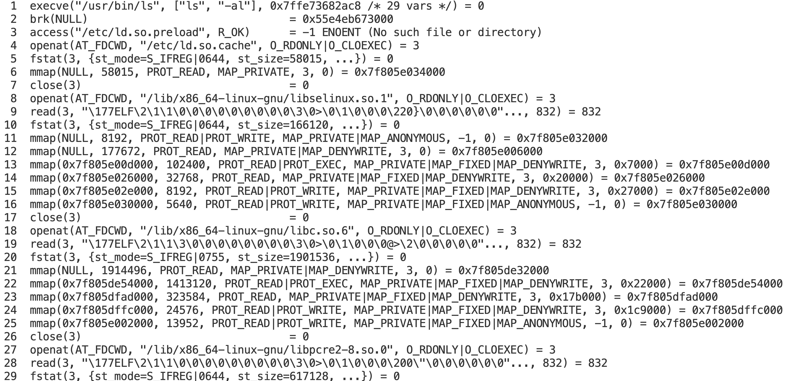

# Tracing System Overview

## Table of Contents

1. [Probe Point](#probe-point)
1. [Static vs. Dynamic Probing](#static-vs-dynamic-probing)
1. [Event Sources](#event-sources)
1. [Frontend](#frontend)
1. [Which Function to Probe](#which-function-to-probe)

## Probe Point

A probe point is a debug statement that helps explore execution characteristics of software (i.e., the execution flow and state of software data structure at the moment a probe statement executes). `printk` is the simplest form of probe statement and one of the fundamental tools used by developers for kernel hacking.

## Static vs. Dynamic Probing

Because it requires recompilation of source code, `printk` insertion is a static probing method. There are also many static tracepoints at important locations (defined at compile time) in the kernel code that can be enabled or disabled dynamically (at runtime). Dynamic probing is inserting instrumentation code into live software (change relevant assembly code at runtime without recompiling the source code).

| Type | Pros| Cons |
| ---- | --- | ---- |
| Static | can be placed anywhere in code (including in **inline**'d functions), high visibility on variables, more stable API (can be seen as built-in features) | many defined static tracepoints can become a maintenance burden, requires recompiling/rebuilding to add new tracepoints |
| Dynamic | zero overhead when not in use, no recompiling or rebuilding needed | functions can be renamed or removed from one software version to the next (interface stability issue), no visibility on **inline**'d functions, it might be hard to figure out where to probe because you might need to look into the assembly code to find the address of probed instruction |

## Event Sources

Main idea:

1. The kernel exposes a mechanism – typically some system file that you can write to – to register an intent to trace an event and what should happen when an event occurs.
2. Once registered, the kernel looks up the location in memory of the kernel/user space function/tracepoint/probe, and modifies its code so that something else happens when a program hits it.
3. The result of that "something else" can be collected later through some mechanism.

Event data can come from the kernel or from user space (apps and libraries).

- On the kernel side
  - [**kprobe**](./kprobe.md)  
    is the mechanism that allows dynamically tracing an event inside kernel. The kernel dynamically **modifies** your program's
    assembly code and **inserts** extra code at runtime in order to enable tracing. This is super powerful (and kind of scary!) because you can enable a probe on literally any instruction in the program you’re tracing, without the need to manually annotate the source code or rebuilding the kernel. But **kprobe** events can change arbitrarily from kernel version to version because functions or variables can be added, removed or renamed at any time.
  - [**kernel tracepoint**](./kernel-tracepoints.md)  
    allows tracing custom events that the kernel developers have defined. It is something you compile into your
    program. When someone using your program wants to see when that tracepoint is hit and extract data, they can, at runtime, **enable** or **activate** the tracepoint to start using it. Generally a tracepoint in this sense doesn’t cause any extra overhead when it’s not activated, and is relatively low overhead when it is activated. Kernel developers must manually annotate the kernel code to define such tracepoints. **Kernel tracepoint**s tend to stay more consistent over time, and one can access any information the kernel developer decided to manually annotate.
- On the user space side:
  - **uprobe**  
    is like **kprobe**, but works on the user-space level.
  - **USDT probe** (Userland Statically Defined Tracing)  
    is like **kernel tracepoint** for user space. App developers have to manually annotate their code with **USDT probe**s.

## Frontend

Frontends are apps that allow users to easily make use of the event sources:

- tell the kernel what data to collect / programs to run
- display the data in a useful way

[ftrace](./ftrace.md) and [eBPF](./ebpf.md) are very popular frontends.

## Which Function to Probe

In general, you can use a tracer to print the function trace.  
For example, if you want to count every time a program is executed, you can search for the function you want to probe like this:

```bash
strace -o trace.log ls -al
```

`strace` is a powerful tool for debugging and troubleshooting programs. It captures and records all system calls made by a process and the signals received by the process. In this case, we are tracing `ls -al` program.

You can either run a program/command with `strace` or pass a `PID` to it using the `-p` option to attach to a running process.  
The `-o` option logs the `strace` output to a file, in this case, named **trace.log**. If `-o` is not specified, the output will be dumped onto your screen.  
Another useful option is `-f`, which traces all child processes created by the program. Note that `-p PID -f` will attach all threads of process `PID` if it is multi-threaded, not only thread with `thread_id` = `PID`.

The **trace.log** should look similar to this:



Take a look at the first line:

- The first word of the line, `execve`, is the name of a system call being executed.
- The text within the parentheses is the arguments provided to the system call.
- The number after the `=` sign (which is `0` in this case) is a value returned by the `execve` system call.

It looks like `execve` is the function we want to intercept! We now need its memory address to probe it later.  
`execve` is actually a syscall name. The corresponding kernel function (symbol name) can be architecture-dependent, like `__x64_sys_execve` or `__ia32_sys_execve`. You can find the symbol name corresponding to a system call by checking the system call table of the Linux kernel source code.

After you have the actual symbol name, let’s search for it:

```bash
sudo grep sys_execve /proc/kallsyms
```

See [here](../kernel-module/symbols-and-module-export.md#kallsyms) for more information about **kallsyms**.

So now we have the function address. We can probe it!

Note that sometimes the `strace` output is too long and we can filter out what we don't want to see by using the `-e` option. For example, to show only the `open` syscall, we can do:

```bash
strace -o trace.log -e trace=open ls -al
```
