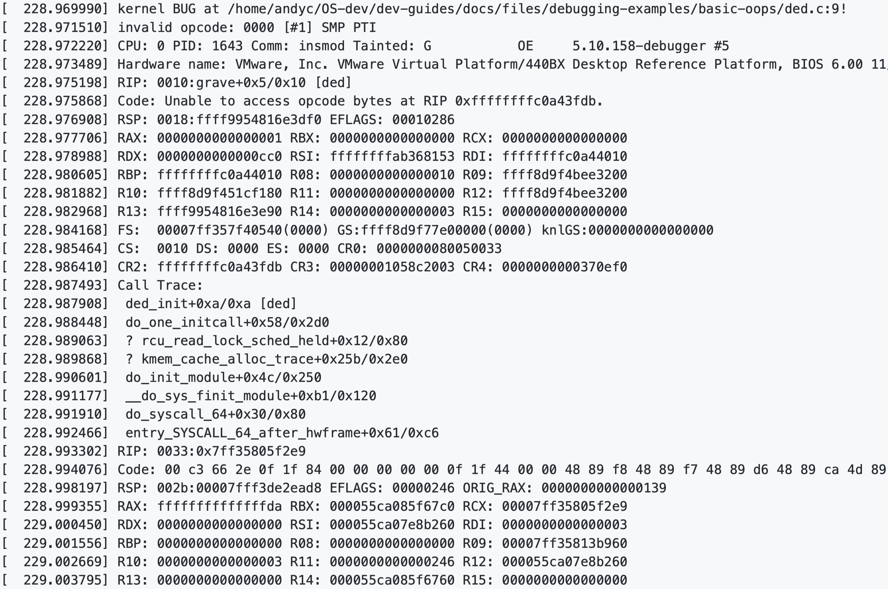

# Kernel Debugging

## Table of Contents

1. [Kernel Crashes](#kernel-crashes)
1. [Understanding the Oops Dump](#understanding-the-oops-dump)
1. [Using GDB to Debug](#using-gdb-to-debug)
1. [Using objdump to Disassemble the Binary Code](#using-objdump-to-disassemble-the-binary-code)

## Kernel Crashes

Kernel crashes are divided into:

1. Kernel Oops (“oops” like you just dropped your glass of wine or stepped on your cat. Oops!)
1. Kernel Panic
1. Kernel Lockup

- A **kernel oops** is an unexpected error situation in the Linux kernel. An oops can occur, for example, due to an invalid memory access. An oops can also be triggered by calls to `BUG()` or `panic()`, which are placed in error cases to provide debugging information. An oops dumps its message on the console; it contains the processor status and the CPU register values when the fault occurred.  
The offending process that triggered this oops gets killed without releasing locks or cleaning up structures (*an oops is not a controlled situation and the kernel doesn't know whether those operations are safe or not*). The system may not even resume its normal operations sometimes; this is called an unstable state. Once an oops has occurred, the system cannot be trusted any further.
- A **kernel panic** is a subset of the oops (i.e., the most serious one). A panic occurs when a problem detected by the kernel is bad enough that the kernel decides that the kernel must stop running immediately to prevent data loss or other damage to the system. So, the system then needs to be halted and rebooted to keep any inconsistencies from making it unusable or unreliable. So a system that panics is actually trying to protect itself from irrevocable damage.
- A **kernel lockup** is a bug that causes the kernel to be unresponsive or hang. This is often due to deadlocking.

## Understanding the Oops Dump

Let's create a kernel module called **ded** that deliberately causes a kernel oops. A typical oops dump might look like this:



The first line is a general overview of the issue (why the kernel failed). In this case, we caused the kernel to report an oops using `BUG()` function.

```bash
[  228.969990] kernel BUG at /home/andyc/OS-dev/dev-guides/docs/files/debugging-examples/basic-oops/ded.c:9!
```

This line describes exactly what task caused the issue. From this line, we can see that the kernel oops occurred on **CPU 0** while running **PID 1643**. We further see that the program was called **insmod**, and the kernel name was **5.10.158-debugger**. The Tainted flag points to `G` here. Each flag has its own meaning.

```bash
[  228.972220] CPU: 0 PID: 1643 Comm: insmod Tainted: G           OE     5.10.158-debugger #5
```

**RIP** refers to the current instruction pointer when the oops was generated (it might have different names depending on the architectures, e.g. **PC**). It shows exactly what function we were running when the bug occurred, in this case `grave`. The `[ded]` at the end of the line indicates that this instruction was from the **ded** module. The `+0x5` in this line represents the offset of the current instruction from the start of `grave`, and the `0x10` represents the total length of the `grave` function. It follows the `<symbol> + the offset/length` format.

```bash
[  228.975198] RIP: 0010:grave+0x5/0x10 [ded]
```

The dump also shows the values of other registers.

This is the call trace of the last few functions that were called prior to the oops. Note that the addresses are function return addresses.  
From this trace, we can see that, prior to running `grave`, we called `ded_init`. Further down, we can see that this entire chain was caused by `do_init_module`.

```bash
[  228.987493] Call Trace:
[  228.987908]  ded_init+0xa/0xa [ded]
[  228.988448]  do_one_initcall+0x58/0x2d0
[  228.989063]  ? rcu_read_lock_sched_held+0x12/0x80
[  228.989868]  ? kmem_cache_alloc_trace+0x25b/0x2e0
[  228.990601]  do_init_module+0x4c/0x250
[  228.991177]  __do_sys_finit_module+0xb1/0x120
[  228.991910]  do_syscall_64+0x30/0x80
[  228.992466]  entry_SYSCALL_64_after_hwframe+0x61/0xc6
```

A `?` at the beginning of a line means that the kernel is not certain that the given line is accurate. The trace is generated by scanning the full kernel stack for return addresses stored on the kernel stack, from stack top to stack bottom, and printing out anything that 'looks like' a kernel text address. If the stack output mechanism is unable to prove that the address it has found is a valid return address, it will add a `?` to the beginning of the line. This way we will always print out the real call chain (plus a few more entries), regardless of whether the frame pointer was set up correctly or not - but in most cases we’ll get the call chain right. The entries printed are strictly in stack order, so you can deduce more information from that as well. Refer to [here](../kernel-trace/perf.md#prerequisites) for some tips to fix stacks.

### Tip

Sometimes you will see a set of register values between function calls in the stack trace, it's often because of a context switch or interrupt that occurred. Those register values represent the state of CPU at the time of the context switch or interrupt.

Sometimes you might see multiple issues in a single oops message. It might be that one bug leads to another, or they might occur simultaneously but unrelated. Debugging typically starts with the first error encountered.

## Using GDB to Debug

Load the relevant binary file that contains debugging symbols.

```bash
gdb <object_file>.o
# or
gdb <module>.ko
```

Then in the `gdb` command line, utilize the `list` command like so:

```bash
(gdb) l *(<function_name>+<offset>)
```

For example:

```bash
(gdb) l *(ded_init+0xa)
```

If you want to see the assembly code, you can use `disassemble` command:

```bash
(gdb) disassemble function_name
```

You can also use `gdb` for addresses inside the kernel like this:

```bash
cd <path-to-kernel-source>
gdb ./vmlinux
```

## Using objdump to Disassemble the Binary Code

To disassemble the kernel image to a file called **asm_file.log**. Note that this file will be large.

```bash
cd <path-to-kernel-source>
objdump -D ./vmlinux > asm_file.log
```

`-D` indicates that this command disassembles the contents of all sections, not just those expected to contain instructions.

You can also use `objdump` to disassemble object files (**.o**) or module files (**.ko**).
