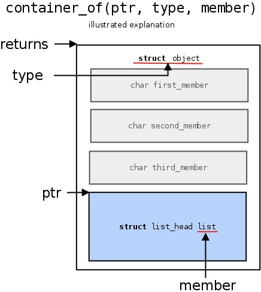
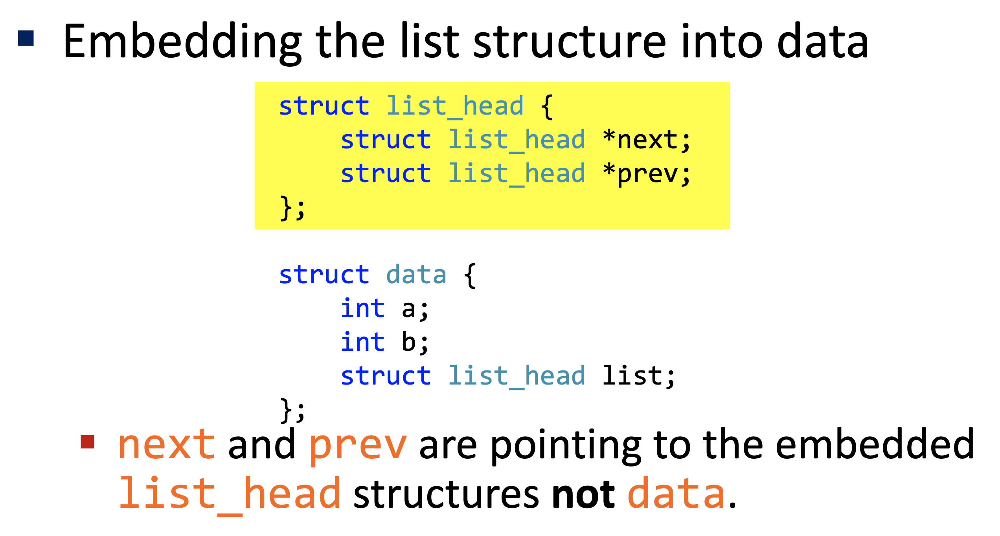
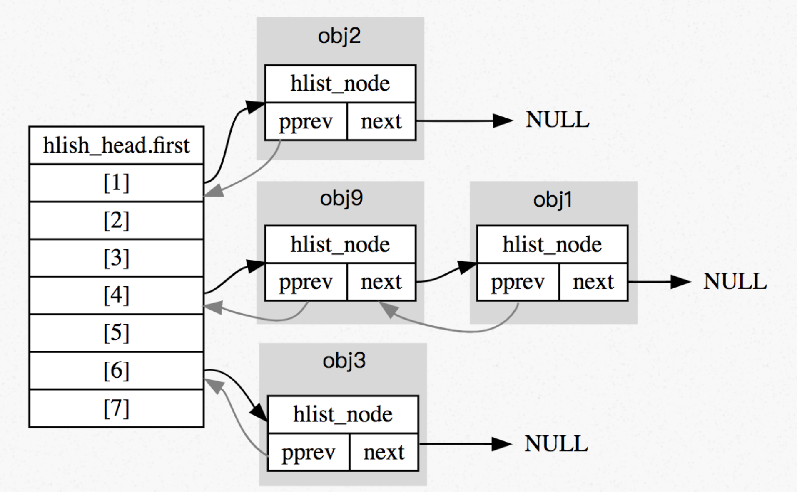

# Kernel Utilities

## Table of Contents

1. [sudo dmesg](#sudo-dmesg)
1. [offsetof Macro](#offsetof-macro)
1. [container_of Macro](#container_of-macro)
1. [Branch Annotation](#branch-annotation)
1. [Linked List](#linked-list)
1. [Hash Table](#hash-table)

## `sudo dmesg`

`dmesg` is a command on Linux that prints the message buffer of the kernel. [Here](../kernel-module/hello-world-module.md#a-tip-about-dmesg) is a tip!

## `offsetof` Macro

```c
#include <stddef.h>
size_t offsetof(type, member);
```

The macro `offsetof()` returns the offset of the field `member` from the start of the parent structure `type`, in units of bytes.  
This macro is useful because the sizes of the fields that compose a structure can vary across implementations, and compilers may insert different numbers of padding bytes between fields. Consequently, an element's offset is not necessarily given by the sum of the sizes of the previous elements.

Example

```c
struct s {
    int i;
    char c;
    double d;
    char a[];
};

size_t offset = offsetof(struct s, d);
```

## `container_of` Macro

`container_of` macro takes three arguments - a pointer, the type of the container, and the name of the member the pointer refers to. The macro will then expand to a new address pointing to the start of the container which accommodates the respective member.



## Branch Annotation

`likely()` and `unlikely()` are hints to compilers about which way a branch may go. For example, many developers use them for error checking, because in most cases code jumps to the normal execution path, and only in case of an error does it jump to the error handling code.

```c
/* predict 'error' is nearly always zero ... */
if (unlikely(error)) {
/* ... */
}

/* predict 'success' is nearly always nonzero ... */
if (likely(success)) {
/* ... */
}
```

## Linked List

Linux kernel provides its own implementation of doubly linked list, which you can find in the **include/linux/list.h**.



When first encountering this, most people are confused because they have been taught to implement linked lists by adding a pointer in a structure which points to the next similar structure in the linked list. The drawback of this approach, and the reason for which the kernel implements linked lists differently, is that you need to write code to handle adding / removing elements specifically for that data structure. Here, we can **add a `struct list_head` field to any other data structure and make it a part of a linked list**. Moreover, if you want your data structure to be part of several data structures, adding a few of these fields will work out just fine.

### Creating a Linked List

```c
#include <linux/list.h>

struct mystruct {
    int data;
    struct list_head mylist;
};

struct mystruct first = {
    .data = 10,
    .mylist = LIST_HEAD_INIT(first.mylist)
};

struct mystruct second;
second.data = 20;
INIT_LIST_HEAD(&second.mylist);

LIST_HEAD(mylinkedlist);

list_add (&first.mylist, &mylinkedlist);
list_add (&second.mylist, &mylinkedlist);
```

At this point, we have a handle on a doubly-linked list (`mylinkedlist` as the head) which contains two nodes (excluding the head node).

- Both `LIST_HEAD_INIT` and `INIT_LIST_HEAD` initialize a `list_head` to be empty, but they take different arguments. If you are **statically** declaring a `list_head`, you should use `LIST_HEAD_INIT`; you should use `INIT_LIST_HEAD` for a `list_head` that is **dynamically** allocated, usually part of another structure (note that `INIT_LIST_HEAD` takes an address as argument).
- `LIST_HEAD(mylinkedlist)` is used to define and initialize an empty instance of a doubly-linked list in the name of `mylinkedlist`. You can think of `mylinkedlist` as the head of the linked list. The `LIST_HEAD` macro takes care of both defining and initializing the list, so you can start adding elements to it right away. However, be aware that `LIST_HEAD` creates a **static** list. If you need a **dynamic** one, you would create an instance of `struct list_head` and then initialize it using the `INIT_LIST_HEAD`.
- `list_add(&new, &old)` adds the `new` node to the list **immediately after** the `old` node. If you have a list like `A->B->C` and you use `list_add` to add a new entry `D` after `A`, the new list will be `A->D->B->C`. You can also use `list_add_tail(&new, &old)` to add the `new` node to the list **immediately before** the `old` node. Because the list is circular, so if you pass the **head** node for the `old`, `list_add_tail` adds the `new` node before the **head** node, which can be considered the tail of the list.
- If you want to delete a node, you can use `list_del(struct list_head *node)`. For example, `list_del(&(first.mylist))`.

Now that we have a list, how do we access the list entry? You can use `list_entry()` for this purpose, which will map a `list_head` structure pointer back into a pointer to the structure that contains it (similar to [`container_of`](#container_of-macro)).

```c
list_entry(struct list_head *ptr, type_of_struct, field_name)
```

### Traversing a Linked List

The traversal of linked lists is easy: one needs only follow the `prev` and `next` pointers. The kernel also provides a macro `list_for_each(cursor, head)` that expands to a `for` loop and requires you to provide a pointer to the list head (`head`) and a pointer to be updated by the loop to point to each consecutive element of the linked list (`cursor`).

Note that *if your loop may delete entries in the list, use `list_for_each_safe(cursor, next, head)`*. It simply stores the next entry in the list in `next` at the beginning of the loop, so it does not get confused if the entry pointed by `cursor` is deleted.

To iterate over list of the containing structure type, use `list_for_each_entry(cursor, head, field_name)`. Here, `cursor` is a pointer to the containing structure type, and `field_name` is the name of the `list_head` structure within the containing structure.

## Hash Table

A hash table is just an array of fixed size of `struct hlist_head`. Each of those represents a bucket, and is the head of a linked list of `struct hlist_node`.  
The hash table does not really store the entire user-defined struct, it merely holds a pointer to the `struct hlist_node` field of each element.

```c
#include <linux/hashtable.h>

struct hlist_head {
    struct hlist_node *first;
};

struct hlist_node {
    struct hlist_node *next, **pprev;
};

// User-defined struct
struct mystruct {
    int data ;
    struct hlist_node node ;
};
```

Since the hash table has two struct, when trying to point to the previous element, the element can be either of type `hlist_head` or `hlist_node`. We cannot use one common pointer type to point to both element types (of course, we can use `void*` but it is not a good type of pointer and need type cast before actually using it). The solution is to let the `prev` pointer point to a common struct type, which is `struct hlist_node*`. This common type is shared by field `first` in `hlist_head` and also field `next` in `hlist_node`. Therefore `prev` pointer becomes `struct hlist_node** pprev` that can point to both `hlist_head.first` and `hlist_node.next`.



### Defining a Hash Table

Use `DEFINE_HASHTABLE(name, bits)` macro to **statically** define and initialize a hash table.

- `name`: the name of the hash table
- `bits`: the number of bits of hash values

So the following definition will have 8 buckets.

```c
DEFINE_HASHTABLE(htable, 3)
```

### Hash Table Operations

- `hash_init` - initialize a hash table (usually used for a **dynamically** allocated hash table)
- `hash_empty` - check whether a hash table is empty
- `hash_add` - add an object to a hash table
- `hash_add_rcu` - add an object to a **rcu**-enabled hash table (allow lookups to proceed in parallel with updates, improve the performance of read-mostly workloads)
- `hash_del` - remove an object from a hash table
- `hash_del_rcu` - remove an object from a **rcu**-enabled hash table
- `hash_for_each` - iterate over a hash table
- `hash_for_each_rcu` - iterate over a **rcu**-enabled hash table
- `hash_for_each_possible` - iterate over all possible objects hashing to the same bucket

### Example

```c
struct object
{
    int id;
    char name[16];
    struct hlist_node node; // Will be initilaized when added to the hash table
};

// Define a hash table with 2^3(=8) buckets
DEFINE_HASHTABLE(htable, 3);
struct object obj1 = {
    .id = 1,
    .name = "obj1",
};

// The last argument is a pre-computed hash value for the node, in this case, the id
// It is used to determine the correct bucket where the node should be added.
hash_add(htable, &obj1.node, obj1.id);

struct object obj2 = {
    .id = 2,
    .name = "obj2",
};
hash_add(htable, &obj2.node, obj2.id);

struct object obj3 = {
    .id = 3,
    .name = "obj3",
};
hash_add(htable, &obj3.node, obj3.id);

struct object obj9 = {
    .id = 9,
    .name = "obj9",
};
hash_add(htable, &obj9.node, obj9.id);
```
