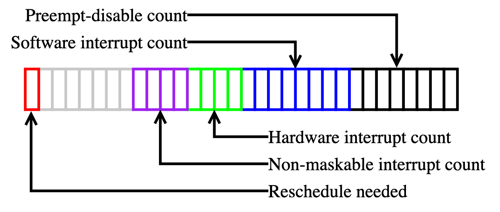

# Preemption

**Preemption**: the ability of the operating system to preempt or stop a currently scheduled process in favour of a higher priority process.

Scheduling functions (or scheduler) stop the currently running process, pick up another appropriate process from the run queue and allocate CPU to that process. Preemption can be triggered by interrupts (e.g., timer interrupts) or when the running thread explicitly calls the scheduling functions or when it blocks. Many critical code paths in kernel might invoke the scheduler.

- For example, when the timer interrupt exits, the kernel checks whether it should invoke the scheduler. If the current thread has run out of time, the timer interrupt would set a flag so that the kernel knows it should call the scheduling functions when it checks if a reschedule is necessary.
- Another example is that blocking functions usually call the scheduling functions to yield the processor.

## User-Space Tasks

User-space programs have always been **preemptible**: the kernel interrupts user-space programs to switch to other threads, using the regular clock tick. So, the kernel doesn't wait for user-space programs to explicitly release the processor (which is the case in cooperative multitasking). This means that an infinite loop in a user-space program cannot block the system.

## Kernel-Space Tasks

Kernel preemption can be enabled or disabled using the `CONFIG_PREEMPT` option.

- If `CONFIG_PREEMPT` is **enabled**, then kernel code can be **preempted almost everywhere**.  
    The main advantage of a preemptive kernel is that sys-calls do not block the entire system. If a sys-call takes a long time to finish then it doesn't mean the kernel can't do anything else in this time. For example, when a user-level thread is required to execute, the scheduler might preempt a lower-priority kernel thread to allow the higher-priority user-level code to run. Kernel preemption can also occur explicitly, when a task in the kernel blocks or calls the `schedule()` function.
- If `CONFIG_PREEMPT` is **disabled**, then the kernel itself is **non-preemptible**:  
    As soon as one thread has entered the kernel, it could not be preempted to execute another thread. The processor could be used to execute another thread when the currently running thread is terminated, or when the thread explicitly asks the scheduler to run another thread using the `schedule()` function. This means that an infinite loop in the kernel code can block the entire system (the kernel code is carefully designed so that there are no infinite loops). *Note that disabling preemption means that the currently running thread cannot be involuntarily scheduled out by the scheduler to run another thread, but interrupt could still happen, e.g., keyboard interrupt could still occur if a user types something*.

## Blocking Functions v.s. Non-Blocking Functions

- A blocking function is a function that can take a long time to execute and causes the calling process or thread to wait (or "block" or "sleep") until the function has completed its operation.
- A non-blocking function, on the other hand, returns immediately whether or not it has completed its operation. For I/O operations, a non-blocking function might return an indication that there's no data available yet, and it would be up to the calling code to try again later.

Usually when a blocking function is called, the control of the processor is yielded to the kernel, which will schedule another thread to run. When the blocking operation finishes, the kernel will schedule the thread that called the blocking function.

- From the point of view of the program that runs the blocking function, all it knows is that the blocking function has been called: the register that points to the current instruction has not changed, the virtual memory is the same as before. The process is "blocked". It does not mean that the CPU is not running.

- From the point of view of the kernel, the program is in waiting mode until the the blocking operation finishes. In the meantime, the scheduler has woken up another process, restored its context (i.e. the value of the CPU registers have been set to what they were just before it fell asleep, etc.), and started executing its code.

## `preempt_count`

To support kernel preemption, the kernel uses `preempt_count` which is stored in each thread's state information. The purpose of this counter is to describe the current state of the thread that has been running, whether it can be preempted, and whether it is allowed to sleep.

The least-significant byte tracks the nesting of `preempt_disable()` calls — the number of times that preemption has been disabled so far. It begins at zero and increments once for each `preempt_disable()` call. For each `preempt_disable()` call, a corresponding call to `preempt_enable()` is required.  
The next three fields track the number of times the running thread has been interrupted by software, hardware, and non-maskable interrupts; they are all probably oversized for the number of interruptions that is likely to ever happen in real execution, but bits are not in short supply here. Finally, the most-significant bit indicates whether the kernel has decided that the current process needs to be scheduled out at the first opportunity.

Any non-zero value for `preempt_count` indicates that the current thread cannot be preempted by the scheduler:

- either preemption has been disabled explicitly,
- or the CPU is currently servicing some sort of interrupt.

A non-zero value indicates that the current thread cannot be scheduled out, since it is running in a context that must be allowed to run to completion. The `reschedule needed` bit tells the kernel that there is a higher-priority process that should be given the CPU at the first opportunity. This bit cannot be set unless `preempt_count` is non-zero; otherwise the kernel would have simply preempted the process rather than setting the bit and waiting.
