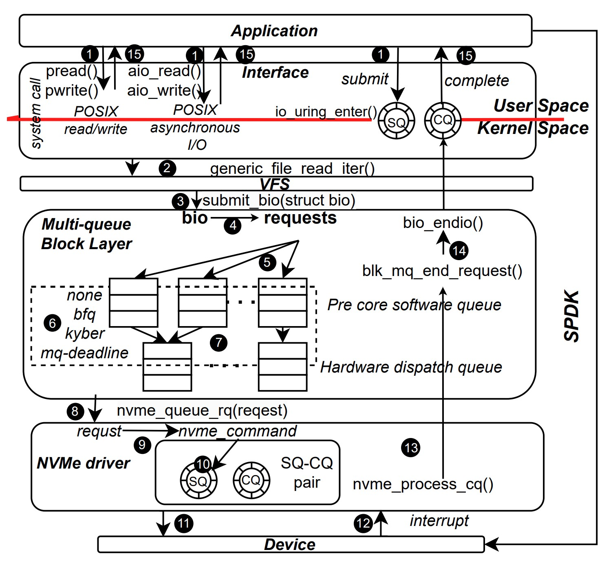
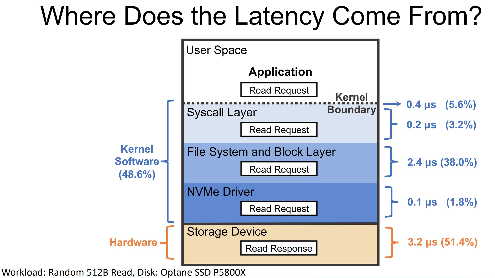
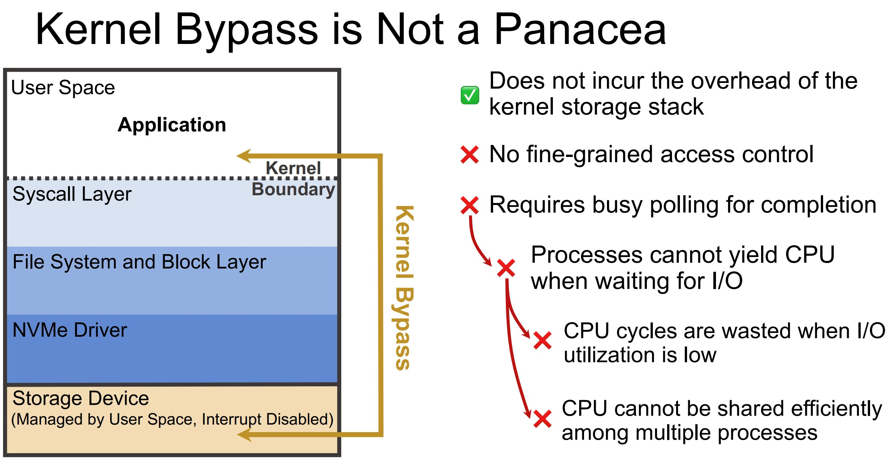

# References

## Storage Stack

- [Understanding Modern Storage APIs](./papers/Understanding_Modern_Storage_APIs.pdf)
- [Modern Storage Stack Performance Characterization](./papers/Modern_Storage_Stack_Performance_Characterization.pdf)

- [In-Kernel Storage Functions with eBPF](./papers/In-Kernel_Storage_Functions_with_eBPF.pdf)

## EXT4 File System

